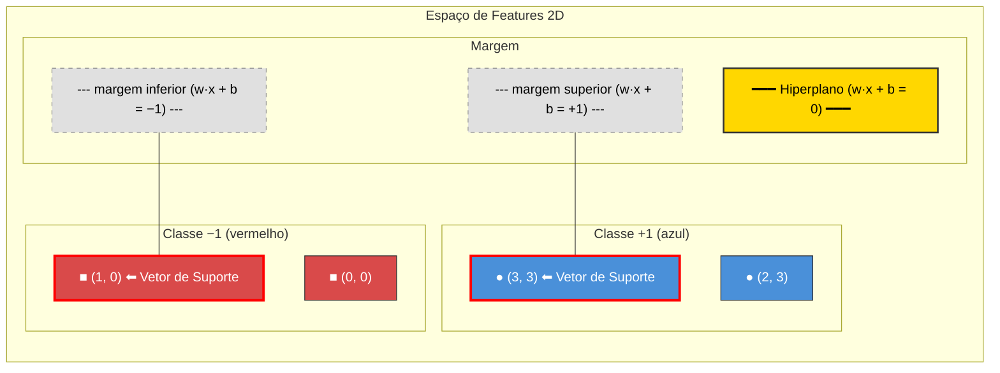
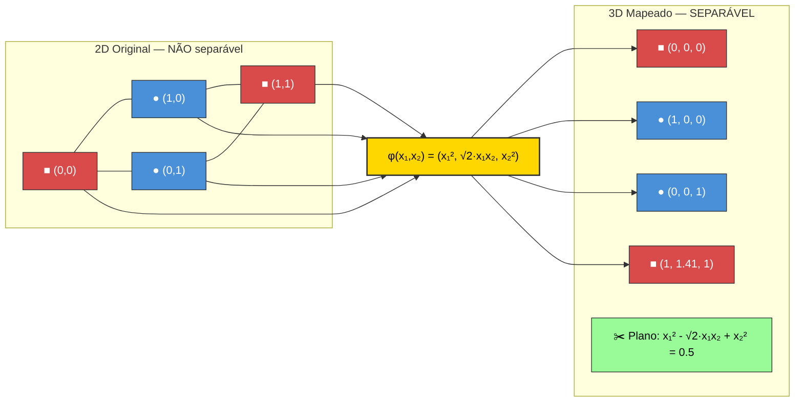

# Aula 24 — Support Vector Machines (SVM)

> **Módulo 05 · Regressão e Classificação** | ⏱ 45 minutos

## Objetivos de Aprendizagem
- Compreender a geometria do SVM e o conceito de margem máxima
- Aplicar kernels para separação não-linear
- Usar SVM para classificação e regressão com Scikit-learn

---

## 1. Intuição: Margem Máxima

O SVM encontra o **hiperplano que maximiza a margem** entre as classes. Os pontos mais próximos do hiperplano são os **vetores de suporte**.

$$\text{Margem} = \frac{2}{\|\mathbf{w}\|}$$

**Problema de otimização:**
$$\min_{\mathbf{w}, b} \frac{1}{2}\|\mathbf{w}\|^2 \quad \text{sujeito a } y^{(i)}(\mathbf{w}^T\mathbf{x}^{(i)} + b) \geq 1$$

### Analogia Intuitiva

Imagine um pátio de escola com dois grupos de crianças — um de camiseta **azul** e outro de camiseta **vermelha**. Você precisa desenhar uma linha no chão para separar os dois grupos. Existem infinitas linhas possíveis, mas o SVM escolhe aquela que deixa o **maior espaço vazio (margem) entre a linha e as crianças mais próximas** de cada lado. As crianças que ficam na borda desse espaço são os *vetores de suporte* — se qualquer uma delas se movesse, a linha teria que mudar. As crianças mais distantes não influenciam a posição da linha.

### Diagrama: Margem, Hiperplano e Vetores de Suporte



> **Legenda:** O hiperplano (linha dourada) é posicionado de modo a maximizar a distância até os vetores de suporte (pontos com borda vermelha). Apenas esses pontos determinam a posição do hiperplano.

### Exemplo Numérico Passo a Passo (SVM Linear 2D)

Considere 4 pontos em 2D:

| Ponto | $x_1$ | $x_2$ | Classe $y$ |
|-------|--------|--------|------------|
| A     | 1      | 2      | +1         |
| B     | 2      | 3      | +1         |
| C     | 1      | 0      | −1         |
| D     | 0      | 1      | −1         |

**Passo 1 — Identificar os vetores de suporte:**

Os pontos mais próximos da fronteira de decisão são **D = (0, 1)** (classe −1) e **A = (1, 2)** (classe +1). Esses são os vetores de suporte.

**Passo 2 — Encontrar o hiperplano:**

O hiperplano ótimo passa pelo ponto médio entre os vetores de suporte na direção perpendicular à linha que os conecta.

Vetor de A para D: $(0 - 1, 1 - 2) = (-1, -1)$, que define a direção de $\mathbf{w}$.

Normalizando: $\mathbf{w} = (1, 1)$ (direção perpendicular à fronteira).

Ponto médio: $\left(\frac{1+0}{2}, \frac{2+1}{2}\right) = (0{,}5;\ 1{,}5)$

Calculando $b$: $\mathbf{w}^T \cdot \text{ponto\_médio} + b = 0 \Rightarrow 1(0{,}5) + 1(1{,}5) + b = 0 \Rightarrow b = -2$

**Hiperplano:** $x_1 + x_2 - 2 = 0$

**Passo 3 — Verificar as classificações:**

| Ponto | $\mathbf{w}^T\mathbf{x} + b$ | $y \cdot f(\mathbf{x})$ | Correto? |
|-------|-------------------------------|--------------------------|----------|
| A (1,2) | $1 + 2 - 2 = 1$           | $+1 \times 1 = 1 \geq 1$ ✅ | Sim |
| B (2,3) | $2 + 3 - 2 = 3$           | $+1 \times 3 = 3 \geq 1$ ✅ | Sim |
| C (1,0) | $1 + 0 - 2 = -1$          | $-1 \times (-1) = 1 \geq 1$ ✅ | Sim |
| D (0,1) | $0 + 1 - 2 = -1$          | $-1 \times (-1) = 1 \geq 1$ ✅ | Sim |

**Passo 4 — Calcular a margem:**

$$\|\mathbf{w}\| = \sqrt{1^2 + 1^2} = \sqrt{2}$$

$$\text{Margem} = \frac{2}{\|\mathbf{w}\|} = \frac{2}{\sqrt{2}} = \sqrt{2} \approx 1{,}41$$

> Os pontos A e D ficam exatamente sobre as margens ($\mathbf{w}^T\mathbf{x} + b = \pm 1$), confirmando que são os vetores de suporte.

---

## 2. Soft Margin — SVM com erros tolerados

Na prática, dados raramente são separáveis linearmente. Introduzimos variáveis de folga $\xi^{(i)} \geq 0$:

$$\min_{\mathbf{w}, b, \boldsymbol{\xi}} \frac{1}{2}\|\mathbf{w}\|^2 + C\sum_{i=1}^{m}\xi^{(i)}$$

- **C pequeno**: margem maior, mais erros tolerados (underfitting)
- **C grande**: margem menor, menos erros tolerados (overfitting)

### Efeito do Parâmetro C

O parâmetro $C$ controla o equilíbrio entre maximizar a margem e minimizar os erros de classificação. Pense nele como um "nível de tolerância a erros":

```mermaid
graph TD
    subgraph "C = 0.01 (Muito Tolerante)"
        A1["🟢 Margem LARGA"]
        A2["⚠️ Vários pontos dentro da margem"]
        A3["📉 Risco de underfitting"]
        A1 --> A2 --> A3
    end

    subgraph "C = 1.0 (Equilibrado)"
        B1["🟡 Margem MÉDIA"]
        B2["✅ Poucos erros na margem"]
        B3["⚖️ Bom equilíbrio viés-variância"]
        B1 --> B2 --> B3
    end

    subgraph "C = 1000 (Muito Rigoroso)"
        C1["🔴 Margem ESTREITA"]
        C2["🎯 Quase zero erros no treino"]
        C3["📈 Risco de overfitting"]
        C1 --> C2 --> C3
    end

    style A1 fill:#2ecc71,stroke:#333,color:#000
    style A2 fill:#f9e79f,stroke:#333,color:#000
    style A3 fill:#f5b7b1,stroke:#333,color:#000
    style B1 fill:#f9e79f,stroke:#333,color:#000
    style B2 fill:#2ecc71,stroke:#333,color:#000
    style B3 fill:#2ecc71,stroke:#333,color:#000
    style C1 fill:#f5b7b1,stroke:#333,color:#000
    style C2 fill:#f9e79f,stroke:#333,color:#000
    style C3 fill:#f5b7b1,stroke:#333,color:#000
```



| C | Margem | Erros no treino | Generalização | Analogia |
|---|--------|-----------------|---------------|----------|
| Pequeno (0.01) | Larga | Muitos tolerados | Pode sub-ajustar | Professor muito leniente |
| Médio (1.0) | Moderada | Equilíbrio | Geralmente boa | Professor justo |
| Grande (1000) | Estreita | Quase nenhum | Pode sobre-ajustar | Professor muito rígido |

**Código para visualizar o efeito de C:**

```python
import matplotlib.pyplot as plt
from sklearn.svm import SVC
from sklearn.datasets import make_moons
import numpy as np

X, y = make_moons(n_samples=200, noise=0.25, random_state=42)

fig, axes = plt.subplots(1, 3, figsize=(15, 4))
C_values = [0.01, 1.0, 1000]

for ax, C in zip(axes, C_values):
    svm = SVC(kernel='rbf', C=C, gamma='scale')
    svm.fit(X, y)

    # Grade para a fronteira de decisão
    xx, yy = np.meshgrid(np.linspace(X[:, 0].min()-0.5, X[:, 0].max()+0.5, 200),
                         np.linspace(X[:, 1].min()-0.5, X[:, 1].max()+0.5, 200))
    Z = svm.decision_function(np.c_[xx.ravel(), yy.ravel()]).reshape(xx.shape)

    ax.contourf(xx, yy, Z, levels=[-1, 0, 1], alpha=0.3, colors=['#ff9999', '#ffffff', '#9999ff'])
    ax.contour(xx, yy, Z, levels=[-1, 0, 1], colors=['red', 'black', 'blue'], linestyles=['--', '-', '--'])
    ax.scatter(X[:, 0], X[:, 1], c=y, cmap='bwr', edgecolors='k', s=30)
    ax.scatter(svm.support_vectors_[:, 0], svm.support_vectors_[:, 1],
               s=100, facecolors='none', edgecolors='green', linewidths=2)
    ax.set_title(f'C = {C}\n({len(svm.support_vectors_)} vetores de suporte)')

plt.tight_layout()
plt.savefig('efeito_C.png', dpi=150, bbox_inches='tight')
plt.show()
```

---

## 3. Kernel Trick — Separação Não-Linear

Mapeia os dados para espaço de maior dimensão sem calcular explicitamente a transformação:

$$K(\mathbf{x}, \mathbf{x}') = \phi(\mathbf{x})^T\phi(\mathbf{x}')$$

| Kernel | Fórmula | Quando usar |
|--------|---------|-------------|
| Linear | $\mathbf{x}^T\mathbf{x}'$ | Dados linearmente separáveis, alta dimensão |
| Polinomial | $(\gamma\mathbf{x}^T\mathbf{x}' + r)^d$ | Relações polinomiais |
| RBF (Gaussian) | $\exp(-\gamma\|\mathbf{x}-\mathbf{x}'\|^2)$ | Uso geral (padrão) |
| Sigmoide | $\tanh(\gamma\mathbf{x}^T\mathbf{x}' + r)$ | Redes neurais |

### Explicação Visual: Kernel Trick com Padrão XOR

O problema XOR é um exemplo clássico de dados **não separáveis linearmente** em 2D. Usando um mapeamento para 3D, os dados se tornam linearmente separáveis.

**Dados no espaço original (2D) — não separáveis:**

| Ponto | $x_1$ | $x_2$ | Classe |
|-------|--------|--------|--------|
| P1    | 0      | 0      | ■ (−1) |
| P2    | 1      | 1      | ■ (−1) |
| P3    | 1      | 0      | ● (+1) |
| P4    | 0      | 1      | ● (+1) |

> Em 2D, nenhuma reta consegue separar ● de ■.

**Mapeamento $\phi$: 2D → 3D**

Definimos: $\phi(x_1, x_2) = (x_1^2,\ \sqrt{2}\, x_1 x_2,\ x_2^2)$

Aplicando o mapeamento:

| Ponto | $(x_1, x_2)$ | $\phi(x_1, x_2) = (x_1^2, \sqrt{2}\,x_1 x_2, x_2^2)$ | Classe |
|-------|---------------|----------------------------------------------------------|--------|
| P1    | (0, 0)        | **(0, 0, 0)**                                            | ■ (−1) |
| P2    | (1, 1)        | **(1, 1.41, 1)**                                         | ■ (−1) |
| P3    | (1, 0)        | **(1, 0, 0)**                                            | ● (+1) |
| P4    | (0, 1)        | **(0, 0, 1)**                                            | ● (+1) |



> **O Truque:** o kernel $K(\mathbf{x}, \mathbf{x}') = (\mathbf{x}^T\mathbf{x}')^2$ calcula o produto interno em 3D **sem nunca construir** $\phi$ explicitamente. Isso é computacionalmente muito mais eficiente, especialmente quando $\phi$ mapeia para dimensões muito altas (ou infinitas, como no caso do kernel RBF).

### Efeito do Parâmetro gamma (Kernel RBF)

O parâmetro $\gamma$ define o "alcance de influência" de cada ponto de treino no kernel RBF:

$$K(\mathbf{x}, \mathbf{x}') = \exp(-\gamma\|\mathbf{x}-\mathbf{x}'\|^2)$$

```mermaid
graph TD
    subgraph "γ = 0.1 (Amplo)"
        G1["🌊 Cada ponto influencia uma região GRANDE"]
        G2["📐 Fronteira de decisão SUAVE"]
        G3["📉 Risco de underfitting"]
        G1 --> G2 --> G3
    end

    subgraph "γ = 1.0 (Moderado)"
        G4["🎯 Influência EQUILIBRADA"]
        G5["📐 Fronteira de decisão MODERADA"]
        G6["⚖️ Bom equilíbrio"]
        G4 --> G5 --> G6
    end

    subgraph "γ = 100 (Estreito)"
        G7["📍 Cada ponto influencia uma região PEQUENA"]
        G8["📐 Fronteira de decisão IRREGULAR"]
        G9["📈 Risco de overfitting"]
        G7 --> G8 --> G9
    end

    style G1 fill:#aed6f1,stroke:#333,color:#000
    style G2 fill:#aed6f1,stroke:#333,color:#000
    style G3 fill:#f5b7b1,stroke:#333,color:#000
    style G4 fill:#a9dfbf,stroke:#333,color:#000
    style G5 fill:#a9dfbf,stroke:#333,color:#000
    style G6 fill:#a9dfbf,stroke:#333,color:#000
    style G7 fill:#f9e79f,stroke:#333,color:#000
    style G8 fill:#f9e79f,stroke:#333,color:#000
    style G9 fill:#f5b7b1,stroke:#333,color:#000
```



**Intuição visual:**

| gamma | Comportamento | Analogia |
|-------|---------------|----------|
| Pequeno (0.1) | Gaussiana **larga** — cada ponto "ilumina" uma área grande | Lanterna de feixe amplo |
| Médio (1.0) | Gaussiana **média** — equilíbrio entre suavidade e detalhe | Lanterna normal |
| Grande (100) | Gaussiana **estreita** — cada ponto "ilumina" apenas ao seu redor | Laser pontual |

**Código para visualizar o efeito de gamma:**

```python
import matplotlib.pyplot as plt
from sklearn.svm import SVC
from sklearn.datasets import make_moons
import numpy as np

X, y = make_moons(n_samples=200, noise=0.25, random_state=42)

fig, axes = plt.subplots(1, 3, figsize=(15, 4))
gamma_values = [0.1, 1.0, 100]

for ax, gamma in zip(axes, gamma_values):
    svm = SVC(kernel='rbf', C=1.0, gamma=gamma)
    svm.fit(X, y)

    xx, yy = np.meshgrid(np.linspace(X[:, 0].min()-0.5, X[:, 0].max()+0.5, 200),
                         np.linspace(X[:, 1].min()-0.5, X[:, 1].max()+0.5, 200))
    Z = svm.decision_function(np.c_[xx.ravel(), yy.ravel()]).reshape(xx.shape)

    ax.contourf(xx, yy, Z, levels=[-1, 0, 1], alpha=0.3, colors=['#ff9999', '#ffffff', '#9999ff'])
    ax.contour(xx, yy, Z, levels=[-1, 0, 1], colors=['red', 'black', 'blue'], linestyles=['--', '-', '--'])
    ax.scatter(X[:, 0], X[:, 1], c=y, cmap='bwr', edgecolors='k', s=30)
    ax.scatter(svm.support_vectors_[:, 0], svm.support_vectors_[:, 1],
               s=100, facecolors='none', edgecolors='green', linewidths=2)
    ax.set_title(f'gamma = {gamma}\n({len(svm.support_vectors_)} vetores de suporte)')

plt.tight_layout()
plt.savefig('efeito_gamma.png', dpi=150, bbox_inches='tight')
plt.show()
```

> **Dica prática:** Use `GridSearchCV` para encontrar a melhor combinação de $C$ e $\gamma$ simultaneamente. Os dois parâmetros interagem entre si!

---

## 4. Implementação

```python
from sklearn.svm import SVC, SVR
from sklearn.datasets import make_moons
from sklearn.model_selection import train_test_split, GridSearchCV
from sklearn.preprocessing import StandardScaler
from sklearn.pipeline import Pipeline
import numpy as np

X, y = make_moons(n_samples=500, noise=0.2, random_state=42)
X_train, X_test, y_train, y_test = train_test_split(X, y, test_size=0.2, random_state=42)

# Pipeline com SVM RBF
pipe_svm = Pipeline([
    ('scaler', StandardScaler()),
    ('svm', SVC(kernel='rbf', C=1.0, gamma='scale', probability=True))
])

# GridSearch para C e gamma
param_grid = {
    'svm__C': [0.1, 1, 10, 100],
    'svm__gamma': ['scale', 'auto', 0.01, 0.1]
}
grid = GridSearchCV(pipe_svm, param_grid, cv=5, scoring='accuracy', n_jobs=-1)
grid.fit(X_train, y_train)

print(f"Melhores parâmetros: {grid.best_params_}")
print(f"Acurácia no teste: {grid.score(X_test, y_test):.4f}")
```

### Plotando Fronteiras de Decisão

```python
import matplotlib.pyplot as plt
import numpy as np
from sklearn.svm import SVC
from sklearn.preprocessing import StandardScaler
from sklearn.datasets import make_moons

def plot_decision_boundary(model, X, y, title="Fronteira de Decisão SVM", ax=None):
    """Plota a fronteira de decisão, margens e vetores de suporte de um SVM."""
    if ax is None:
        fig, ax = plt.subplots(figsize=(8, 6))

    # Grade de pontos para a fronteira
    x_min, x_max = X[:, 0].min() - 0.5, X[:, 0].max() + 0.5
    y_min, y_max = X[:, 1].min() - 0.5, X[:, 1].max() + 0.5
    xx, yy = np.meshgrid(np.linspace(x_min, x_max, 300),
                         np.linspace(y_min, y_max, 300))

    # Função de decisão
    Z = model.decision_function(np.c_[xx.ravel(), yy.ravel()]).reshape(xx.shape)

    # Regiões coloridas
    ax.contourf(xx, yy, Z, levels=50, cmap='RdBu', alpha=0.4)
    # Fronteira de decisão (f=0) e margens (f=±1)
    ax.contour(xx, yy, Z, levels=[-1, 0, 1],
               colors=['red', 'black', 'blue'],
               linestyles=['--', '-', '--'], linewidths=[1, 2, 1])

    # Pontos de dados
    scatter = ax.scatter(X[:, 0], X[:, 1], c=y, cmap='RdBu',
                         edgecolors='k', s=40, zorder=3)

    # Vetores de suporte
    ax.scatter(model.support_vectors_[:, 0], model.support_vectors_[:, 1],
               s=150, facecolors='none', edgecolors='lime',
               linewidths=2, zorder=4, label='Vetores de Suporte')

    ax.set_title(title, fontsize=13)
    ax.legend(loc='upper left')
    return ax


# Exemplo de uso com diferentes kernels
X, y = make_moons(n_samples=300, noise=0.2, random_state=42)
scaler = StandardScaler()
X_scaled = scaler.fit_transform(X)

fig, axes = plt.subplots(1, 3, figsize=(18, 5))
kernels = [('linear', {}), ('poly', {'degree': 3}), ('rbf', {})]

for ax, (kernel, params) in zip(axes, kernels):
    svm = SVC(kernel=kernel, C=1.0, gamma='scale', **params)
    svm.fit(X_scaled, y)
    plot_decision_boundary(svm, X_scaled, y,
                           title=f'Kernel: {kernel.upper()}', ax=ax)

plt.tight_layout()
plt.savefig('fronteiras_decisao_svm.png', dpi=150, bbox_inches='tight')
plt.show()
```

---

## 5. SVR — SVM para Regressão

```python
from sklearn.svm import SVR
from sklearn.datasets import fetch_california_housing

housing = fetch_california_housing()
X_h, y_h = housing.data[:2000], housing.target[:2000]
X_tr, X_te, y_tr, y_te = train_test_split(X_h, y_h, test_size=0.2, random_state=42)

svr_pipe = Pipeline([
    ('scaler', StandardScaler()),
    ('svr', SVR(kernel='rbf', C=10, epsilon=0.1))
])
svr_pipe.fit(X_tr, y_tr)
print(f"R² SVR: {svr_pipe.score(X_te, y_te):.4f}")
```

---

## 6. Exercícios Práticos

### Exercício 1 — Fácil: SVM Linear no Iris 🌱

Treine um SVM com kernel linear no dataset **Iris** usando apenas as features `petal_length` e `petal_width`. Plote a fronteira de decisão.

```python
from sklearn.datasets import load_iris
from sklearn.svm import SVC
from sklearn.preprocessing import StandardScaler
import numpy as np
import matplotlib.pyplot as plt

iris = load_iris()
X = iris.data[:, 2:4]  # petal_length e petal_width
y = iris.target

scaler = StandardScaler()
X_scaled = scaler.fit_transform(X)

# TODO: Treine um SVC com kernel='linear' e C=1.0
# svm = SVC(...)
# svm.fit(...)

# TODO: Plote a fronteira de decisão usando a função plot_decision_boundary
# Dica: use model.decision_function() ou model.predict() na grade de pontos

# Perguntas:
# a) Quantos vetores de suporte o modelo encontrou?
# b) O que acontece se você mudar C de 1.0 para 0.01? E para 100?
```

### Exercício 2 — Médio: Comparando Kernels no Make Moons 🌙

Compare os kernels **linear**, **polinomial (grau 3)** e **RBF** no dataset `make_moons`. Use `GridSearchCV` para encontrar o melhor $C$ para cada kernel e reporte a acurácia de cada um.

```python
from sklearn.datasets import make_moons
from sklearn.svm import SVC
from sklearn.model_selection import train_test_split, GridSearchCV
from sklearn.preprocessing import StandardScaler
from sklearn.pipeline import Pipeline
from sklearn.metrics import classification_report

X, y = make_moons(n_samples=500, noise=0.3, random_state=42)
X_train, X_test, y_train, y_test = train_test_split(X, y, test_size=0.2, random_state=42)

kernels = {
    'linear': {'svm__C': [0.01, 0.1, 1, 10, 100]},
    'poly':   {'svm__C': [0.01, 0.1, 1, 10, 100], 'svm__degree': [2, 3, 4]},
    'rbf':    {'svm__C': [0.01, 0.1, 1, 10, 100], 'svm__gamma': [0.01, 0.1, 1, 10]}
}

# TODO: Para cada kernel, crie um Pipeline com StandardScaler + SVC
# TODO: Use GridSearchCV com cv=5 para encontrar os melhores hiperparâmetros
# TODO: Compare as acurácias no conjunto de teste

# Perguntas:
# a) Qual kernel teve melhor desempenho? Por quê?
# b) Plote as 3 fronteiras de decisão lado a lado
# c) Qual combinação de C e gamma é ótima para o RBF?
```

### Exercício 3 — Difícil: Pipeline Completo com SVM no Dataset de Câncer de Mama 🔬

Construa um pipeline completo de classificação no `breast_cancer` dataset:
1. Pré-processamento com `StandardScaler`
2. Seleção de features com `SelectKBest` (escolha k com busca)
3. SVM com busca de kernel, $C$ e $\gamma$ via `GridSearchCV`
4. Avalie com **validação cruzada estratificada** e reporte: acurácia, precisão, recall, F1 e a **curva ROC com AUC**

```python
from sklearn.datasets import load_breast_cancer
from sklearn.svm import SVC
from sklearn.model_selection import train_test_split, GridSearchCV, StratifiedKFold
from sklearn.preprocessing import StandardScaler
from sklearn.feature_selection import SelectKBest, f_classif
from sklearn.pipeline import Pipeline
from sklearn.metrics import classification_report, roc_curve, auc, RocCurveDisplay
import matplotlib.pyplot as plt

data = load_breast_cancer()
X, y = data.data, data.target
X_train, X_test, y_train, y_test = train_test_split(X, y, test_size=0.2,
                                                     random_state=42, stratify=y)

# TODO: Crie o pipeline: StandardScaler → SelectKBest → SVC(probability=True)

# TODO: Defina o espaço de busca:
# param_grid = {
#     'select__k': [5, 10, 15, 20, 30],
#     'svm__kernel': ['linear', 'rbf'],
#     'svm__C': [0.1, 1, 10, 100],
#     'svm__gamma': ['scale', 0.01, 0.1]
# }

# TODO: GridSearchCV com StratifiedKFold(n_splits=5, shuffle=True, random_state=42)

# TODO: Reporte classification_report no conjunto de teste

# TODO: Plote a curva ROC
# Dica: use model.predict_proba(X_test)[:, 1] para as probabilidades

# Perguntas:
# a) Quantas features foram selecionadas no melhor modelo?
# b) Qual é o AUC do modelo final?
# c) Compare o resultado com um SVM sem seleção de features. A seleção ajudou?
```

---

## Questões para Reflexão
1. Por que o SVM é sensível à escala das features?
2. Como o parâmetro `gamma` afeta a "suavidade" do kernel RBF?
3. Em que situações o SVM pode ser preferível ao Random Forest?

## Referências
- Géron, cap. 5
- Faceli et al., cap. 5

---
*Próxima aula → [Aula 25: Naive Bayes](aula-25-naive-bayes.md)*
