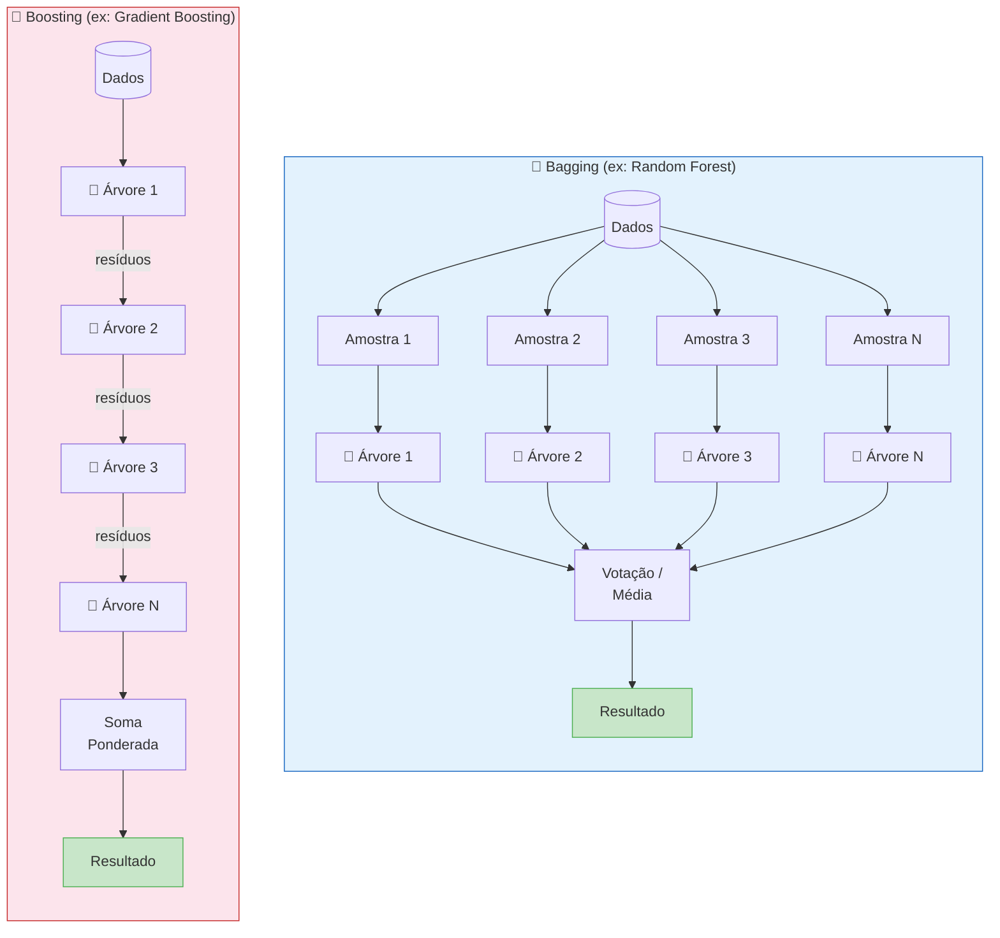

# Aula 29 — Gradient Boosting

> **Módulo 06 · Métodos Baseados em Árvores e Ensembles** | ⏱ 45 minutos

## Objetivos de Aprendizagem
- Compreender boosting como minimização de função de perda por gradiente
- Implementar AdaBoost e Gradient Boosting com Scikit-learn
- Controlar overfitting com shrinkage e subsampling

---

## 1. Intuição: Aprender com os Erros

Enquanto o Random Forest treina modelos **em paralelo** e independentes, o Boosting treina modelos **sequencialmente**, onde cada novo modelo tenta corrigir os erros do anterior.

---

## 2. Analogia Intuitiva: Correção de Provas em Cadeia 📝

Imagine que uma prova é corrigida por uma **sequência de alunos**, um após o outro:

1. **Aluno 1** corrige a prova inteira e dá uma nota inicial. Ele acerta bastante, mas comete alguns erros.
2. **Aluno 2** recebe a prova **junto com os erros que o Aluno 1 cometeu**. Ele não corrige tudo de novo — foca apenas em **consertar os erros** do Aluno 1.
3. **Aluno 3** recebe os erros restantes (que o Aluno 2 não conseguiu corrigir) e tenta corrigi-los.
4. E assim por diante...

No final, a **nota final** é a soma das contribuições de todos os alunos. Cada um contribuiu um pouco, focando nos erros que restavam.

Essa é exatamente a ideia do **Gradient Boosting**:
- Cada "aluno" é uma **árvore de decisão simples** (fraca).
- Os "erros" são os **resíduos** (diferença entre o valor real e a previsão atual).
- A contribuição de cada aluno é ponderada por uma **taxa de aprendizado** ($\eta$), para que nenhum aluno individual domine a nota final.

---

## 3. Processo Sequencial do Boosting

O diagrama abaixo ilustra como cada modelo aprende a partir dos resíduos do modelo anterior:


---

## 4. Bagging vs. Boosting: Comparação Visual



| Característica | Bagging | Boosting |
|---|---|---|
| Treinamento | **Paralelo** (independente) | **Sequencial** (dependente) |
| Objetivo | Reduzir **variância** | Reduzir **viés** |
| Modelos base | Árvores profundas (complexas) | Árvores rasas (stumps) |
| Risco principal | Sub-ajuste (se árvores fracas) | **Overfitting** (se muitas iterações) |
| Exemplo | Random Forest | Gradient Boosting, AdaBoost |

---

## 5. AdaBoost

Ajusta os pesos das amostras: amostras classificadas errado recebem **maior peso**.

```python
from sklearn.ensemble import AdaBoostClassifier
from sklearn.tree import DecisionTreeClassifier
from sklearn.datasets import load_breast_cancer
from sklearn.model_selection import train_test_split, cross_val_score

cancer = load_breast_cancer()
X_tr, X_te, y_tr, y_te = train_test_split(
    cancer.data, cancer.target, test_size=0.2, random_state=42, stratify=cancer.target
)

ada = AdaBoostClassifier(
    estimator=DecisionTreeClassifier(max_depth=2),
    n_estimators=200,
    learning_rate=0.5,
    random_state=42
)
ada.fit(X_tr, y_tr)
print(f"AdaBoost — Acurácia: {ada.score(X_te, y_te):.4f}")
```

---

## 6. Gradient Boosting — Minimização por Gradiente

A cada etapa, treina uma nova árvore nos **pseudo-resíduos** da iteração anterior:

$$F_m(\mathbf{x}) = F_{m-1}(\mathbf{x}) + \eta \cdot h_m(\mathbf{x})$$

Onde $h_m$ é a árvore ajustada nos resíduos negativos do gradiente de $J$.

### 6.1 O que são Pseudo-Resíduos?

No Gradient Boosting, os **pseudo-resíduos** são o **negativo do gradiente** da função de perda com relação à previsão atual:

$$r_{im} = -\frac{\partial \, L(y_i, \, F(\mathbf{x}_i))}{\partial \, F(\mathbf{x}_i)} \Bigg|_{F = F_{m-1}}$$

**Por que "pseudo" e não apenas "resíduos"?**

- No caso de **regressão com erro quadrático** (MSE), a função de perda é $L = \frac{1}{2}(y_i - F(\mathbf{x}_i))^2$. O negativo do gradiente resulta exatamente em:

$$r_{im} = y_i - F_{m-1}(\mathbf{x}_i)$$

  Ou seja, são os **resíduos clássicos** — a diferença entre o valor real e o predito.

- Para **outras funções de perda** (entropia cruzada, Huber, etc.), o negativo do gradiente **não coincide** com os resíduos simples. Por isso chamamos de "pseudo-resíduos": são a direção de descida no espaço funcional que mais reduz a perda.

**Conexão com Gradient Descent:**

| Gradient Descent Clássico | Gradient Boosting |
|---|---|
| Atualiza **parâmetros** $\theta$ | Atualiza a **função** $F(\mathbf{x})$ |
| $\theta_{m} = \theta_{m-1} - \eta \nabla_\theta L$ | $F_m = F_{m-1} + \eta \cdot h_m$ |
| Gradiente em relação a $\theta$ | Gradiente em relação a $F(\mathbf{x})$ |

Ou seja, o Gradient Boosting faz **gradient descent no espaço de funções**, adicionando uma pequena árvore $h_m$ a cada passo na direção que mais reduz o erro.

```python
from sklearn.ensemble import GradientBoostingClassifier, GradientBoostingRegressor
import numpy as np

gb = GradientBoostingClassifier(
    n_estimators=300,
    learning_rate=0.05,   # shrinkage: menor = mais conservador
    max_depth=4,
    subsample=0.8,        # stochastic GB: reduz variância
    min_samples_leaf=5,
    random_state=42
)
gb.fit(X_tr, y_tr)
print(f"GBM — Acurácia: {gb.score(X_te, y_te):.4f}")

# Curva de treino ao longo das iterações
train_err = [1 - acc for acc in gb.train_score_]
test_preds_staged = list(gb.staged_predict(X_te))
test_err = [np.mean(yp != y_te) for yp in test_preds_staged]

import matplotlib.pyplot as plt
plt.plot(train_err, label='Treino')
plt.plot(test_err, label='Teste')
plt.xlabel('Iteração'); plt.ylabel('Erro')
plt.title('Curvas de Erro — Gradient Boosting')
plt.legend()
plt.show()
```

---

## 7. Exemplo Numérico Completo: Gradient Boosting para Regressão

Vamos acompanhar o algoritmo **passo a passo** com 5 pontos de dados, taxa de aprendizado $\eta = 0.1$ e função de perda MSE.

### Dados

| Amostra | $x$ | $y$ (real) |
|---|---|---|
| 1 | 1 | 10 |
| 2 | 2 | 20 |
| 3 | 3 | 30 |
| 4 | 4 | 40 |
| 5 | 5 | 50 |

### Passo 0 — Inicialização

O modelo inicial $F_0$ é a **média** dos valores alvo:

$$F_0 = \bar{y} = \frac{10 + 20 + 30 + 40 + 50}{5} = 30{,}0$$

Previsão inicial para todos os pontos: $F_0(\mathbf{x}) = 30{,}0$

| Amostra | $y$ | $F_0$ | Resíduo $r_0 = y - F_0$ |
|---|---|---|---|
| 1 | 10 | 30,0 | **−20,0** |
| 2 | 20 | 30,0 | **−10,0** |
| 3 | 30 | 30,0 | **0,0** |
| 4 | 40 | 30,0 | **+10,0** |
| 5 | 50 | 30,0 | **+20,0** |

MSE = $\frac{(-20)^2 + (-10)^2 + 0^2 + 10^2 + 20^2}{5} = \frac{1000}{5} = 200{,}0$

---

### Iteração 1 — Primeira árvore $h_1$

Treinamos uma árvore simples (stump) nos resíduos $r_0$. Suponha que a árvore aprenda a divisão:
- Se $x \leq 2$: previsão = $\frac{-20 + (-10)}{2} = -15{,}0$
- Se $x > 2$: previsão = $\frac{0 + 10 + 20}{3} = 10{,}0$

Atualização: $F_1(\mathbf{x}) = F_0(\mathbf{x}) + \eta \cdot h_1(\mathbf{x})$

| Amostra | $F_0$ | $h_1(\mathbf{x})$ | $\eta \cdot h_1$ | $F_1 = F_0 + \eta \cdot h_1$ | $r_1 = y - F_1$ |
|---|---|---|---|---|---|
| 1 | 30,0 | −15,0 | −1,5 | **28,5** | −18,5 |
| 2 | 30,0 | −15,0 | −1,5 | **28,5** | −8,5 |
| 3 | 30,0 | +10,0 | +1,0 | **31,0** | −1,0 |
| 4 | 30,0 | +10,0 | +1,0 | **31,0** | +9,0 |
| 5 | 30,0 | +10,0 | +1,0 | **31,0** | +19,0 |

MSE = $\frac{(-18{,}5)^2 + (-8{,}5)^2 + (-1)^2 + 9^2 + 19^2}{5} = \frac{342{,}25 + 72{,}25 + 1 + 81 + 361}{5} = \frac{857{,}5}{5} = 171{,}5$

> ✅ MSE caiu de **200,0** para **171,5** (melhoria de 14,3%)

---

### Iteração 2 — Segunda árvore $h_2$

Agora treinamos $h_2$ nos novos resíduos $r_1$. Suponha a divisão:
- Se $x \leq 2$: previsão = $\frac{-18{,}5 + (-8{,}5)}{2} = -13{,}5$
- Se $x > 2$: previsão = $\frac{-1 + 9 + 19}{3} = 9{,}0$

| Amostra | $F_1$ | $h_2(\mathbf{x})$ | $\eta \cdot h_2$ | $F_2 = F_1 + \eta \cdot h_2$ | $r_2 = y - F_2$ |
|---|---|---|---|---|---|
| 1 | 28,5 | −13,5 | −1,35 | **27,15** | −17,15 |
| 2 | 28,5 | −13,5 | −1,35 | **27,15** | −7,15 |
| 3 | 31,0 | +9,0 | +0,90 | **31,90** | −1,90 |
| 4 | 31,0 | +9,0 | +0,90 | **31,90** | +8,10 |
| 5 | 31,0 | +9,0 | +0,90 | **31,90** | +18,10 |

MSE = $\frac{(-17{,}15)^2 + (-7{,}15)^2 + (-1{,}9)^2 + 8{,}1^2 + 18{,}1^2}{5} = \frac{294{,}12 + 51{,}12 + 3{,}61 + 65{,}61 + 327{,}61}{5} = \frac{742{,}07}{5} ≈ 148{,}4$

> ✅ MSE caiu de **171,5** para **148,4** (melhoria de 13,5%)

---

### Iteração 3 — Terceira árvore $h_3$

Treinamos $h_3$ nos resíduos $r_2$. Suponha a divisão:
- Se $x \leq 2$: previsão = $\frac{-17{,}15 + (-7{,}15)}{2} = -12{,}15$
- Se $x > 2$: previsão = $\frac{-1{,}9 + 8{,}1 + 18{,}1}{3} = 8{,}1$

| Amostra | $F_2$ | $h_3(\mathbf{x})$ | $\eta \cdot h_3$ | $F_3 = F_2 + \eta \cdot h_3$ | $r_3 = y - F_3$ |
|---|---|---|---|---|---|
| 1 | 27,15 | −12,15 | −1,215 | **25,935** | −15,935 |
| 2 | 27,15 | −12,15 | −1,215 | **25,935** | −5,935 |
| 3 | 31,90 | +8,1 | +0,810 | **32,710** | −2,710 |
| 4 | 31,90 | +8,1 | +0,810 | **32,710** | +7,290 |
| 5 | 31,90 | +8,1 | +0,810 | **32,710** | +17,290 |

MSE = $\frac{(-15{,}94)^2 + (-5{,}94)^2 + (-2{,}71)^2 + 7{,}29^2 + 17{,}29^2}{5} ≈ \frac{254{,}0 + 35{,}3 + 7{,}3 + 53{,}1 + 298{,}9}{5} ≈ \frac{648{,}6}{5} ≈ 129{,}7$

> ✅ MSE caiu de **148,4** para **129,7** (melhoria de 12,6%)

### Resumo da Evolução

| Iteração | MSE | Redução |
|---|---|---|
| 0 (média) | 200,0 | — |
| 1 | 171,5 | −14,3% |
| 2 | 148,4 | −13,5% |
| 3 | 129,7 | −12,6% |

> 📌 **Observação:** Com $\eta = 0{,}1$, a convergência é lenta mas estável. Com mais iterações, o MSE continuaria caindo. Se usássemos $\eta = 1{,}0$, a convergência seria mais rápida, mas com maior risco de **overfitting**.

---

## 8. Hiperparâmetros Chave

| Parâmetro | Efeito | Valor típico |
|-----------|--------|-------------|
| `n_estimators` | Nº de árvores | 100–1000 |
| `learning_rate` | Shrinkage | 0.01–0.1 |
| `max_depth` | Complexidade de cada árvore | 3–6 |
| `subsample` | Fração de amostras por árvore | 0.5–0.9 |
| `min_samples_leaf` | Poda mínima | 5–30 |

> **Regra prática:** menor `learning_rate` → mais `n_estimators` → melhor generalização.

---

## 9. Exercícios Práticos

### Exercício 1 — Gradient Boosting na mão 🧮

Dados os pontos abaixo, realize **2 iterações** de Gradient Boosting para regressão com $\eta = 0{,}5$. Use a função de perda MSE e stumps (árvores de profundidade 1).

| $x$ | $y$ |
|---|---|
| 1 | 4 |
| 2 | 8 |
| 3 | 5 |
| 4 | 9 |

**Tarefas:**
1. Calcule o valor inicial $F_0$ (média).
2. Calcule os resíduos $r_0 = y - F_0$.
3. Proponha uma divisão simples para $h_1$ e calcule $F_1$.
4. Calcule os novos resíduos $r_1$ e repita para $h_2$.
5. Compare o MSE em cada etapa.

---

### Exercício 2 — Comparação experimental: Random Forest vs. Gradient Boosting 🔬

Usando o dataset `diabetes` do Scikit-learn, compare os dois métodos:

```python
from sklearn.datasets import load_diabetes
from sklearn.ensemble import RandomForestRegressor, GradientBoostingRegressor
from sklearn.model_selection import cross_val_score

diabetes = load_diabetes()
X, y = diabetes.data, diabetes.target

# TODO: Crie um RandomForestRegressor e um GradientBoostingRegressor
# TODO: Use cross_val_score com cv=5 e scoring='neg_mean_squared_error'
# TODO: Imprima o MSE médio e desvio padrão de cada modelo
# TODO: Experimente variar learning_rate (0.01, 0.05, 0.1, 0.3) no GBM
#       e mostre como o MSE muda
```

**Perguntas para responder:**
1. Qual modelo obteve menor MSE médio?
2. Qual modelo teve menor variância entre os folds?
3. Como o `learning_rate` afetou o desempenho do Gradient Boosting?

---

### Exercício 3 — Análise de overfitting com curvas de erro 📈

Treine um `GradientBoostingClassifier` no dataset `breast_cancer` com `n_estimators=500` e `learning_rate=0.1`. Plote as curvas de erro de treino e teste.

```python
from sklearn.datasets import load_breast_cancer
from sklearn.ensemble import GradientBoostingClassifier
from sklearn.model_selection import train_test_split
import numpy as np
import matplotlib.pyplot as plt

cancer = load_breast_cancer()
X_tr, X_te, y_tr, y_te = train_test_split(
    cancer.data, cancer.target, test_size=0.2, random_state=42
)

# TODO: Treine o GradientBoostingClassifier com os parâmetros acima
# TODO: Plote train_score_ e staged_predict para encontrar o ponto de overfitting
# TODO: Identifique o número ideal de árvores (onde o erro de teste é mínimo)
# TODO: Retreine o modelo com esse número ideal e compare a acurácia
```

**Perguntas para responder:**
1. A partir de qual iteração o modelo começa a fazer overfitting?
2. Qual seria o `n_estimators` ideal para este dataset?
3. O que aconteceria se reduzíssemos `learning_rate` para 0.01 e aumentássemos `n_estimators` para 2000?

---

## Questões para Reflexão
1. Por que usar `learning_rate` pequeno com muitos estimadores tende a ser melhor?
2. Qual é a relação entre `subsample < 1` e a aleatoriedade do Random Forest?
3. Como detectar o número ótimo de árvores sem overfitting?

## Referências
- Géron, cap. 7
- Faceli et al., cap. 6

---
*Próxima aula → [Aula 30: XGBoost, LightGBM e CatBoost](aula-30-xgboost-lightgbm-catboost.md)*
