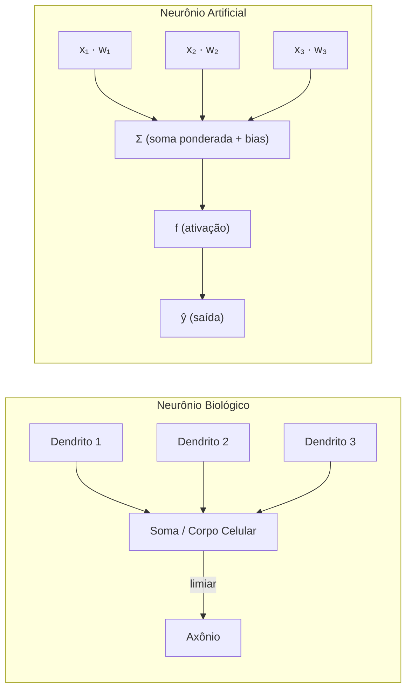
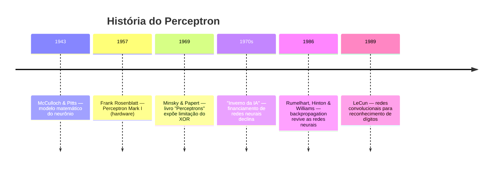

# Aula 32 — Neurônio Artificial e Perceptron

> **Módulo 07 · Redes Neurais Artificiais** | ⏱ 45 minutos

## Objetivos de Aprendizagem
- Compreender a analogia entre neurônio biológico e artificial
- Implementar o Perceptron de Rosenblatt do zero
- Entender os limites do Perceptron (problema XOR)

---

## Como o Cérebro Inspira a IA

O cérebro humano possui aproximadamente 86 bilhões de neurônios interconectados por
sinapses. Cada neurônio recebe sinais elétricos pelos **dendritos**, processa esses
sinais no **corpo celular** (soma) e, se a estimulação total ultrapassar um limiar,
dispara um impulso elétrico pelo **axônio** até os neurônios seguintes. Na década de
1940, McCulloch e Pitts propuseram um modelo matemático simplificado desse processo:
o *neurônio artificial*. Nele, as entradas numéricas substituem os dendritos, pesos
multiplicativos representam a força das sinapses, uma soma ponderada faz o papel do
corpo celular e uma **função de ativação** decide se o neurônio "dispara" ou não.
O diagrama abaixo compara os dois modelos lado a lado:



---

## 1. Neurônio Biológico vs. Artificial

| Biológico | Artificial |
|-----------|-----------|
| Dendritos | Entradas $x_j$ |
| Sinapses | Pesos $w_j$ |
| Corpo celular | Soma ponderada + bias |
| Axônio | Saída $\hat{y}$ |
| Potencial de ação | Função de ativação |

**Modelo matemático:**
$$\hat{y} = f\left(\sum_{j=0}^{n} w_j x_j\right) = f(\mathbf{w}^T\mathbf{x})$$

---

## 2. Perceptron de Rosenblatt (1957)

Função de ativação: degrau de Heaviside.
$$f(z) = \begin{cases} 1 & \text{se } z \geq 0 \\ 0 & \text{caso contrário} \end{cases}$$

**Regra de aprendizado:**
$$w_j \leftarrow w_j + \eta (y^{(i)} - \hat{y}^{(i)}) x_j^{(i)}$$

```python
import numpy as np
import matplotlib.pyplot as plt

class Perceptron:
    def __init__(self, eta=0.01, n_iter=50, random_state=1):
        self.eta = eta
        self.n_iter = n_iter
        self.random_state = random_state

    def fit(self, X, y):
        rgen = np.random.RandomState(self.random_state)
        self.w_ = rgen.normal(loc=0.0, scale=0.01, size=X.shape[1])
        self.b_ = 0.
        self.errors_ = []
        for _ in range(self.n_iter):
            errors = 0
            for xi, yi in zip(X, y):
                update = self.eta * (yi - self.predict_single(xi))
                self.w_ += update * xi
                self.b_  += update
                errors   += int(update != 0.0)
            self.errors_.append(errors)
        return self

    def net_input(self, X):
        return X @ self.w_ + self.b_

    def predict_single(self, xi):
        return 1 if self.net_input(xi) >= 0 else 0

    def predict(self, X):
        return np.where(self.net_input(X) >= 0, 1, 0)

# Teste: AND gate (linearmente separável)
X_and = np.array([[0,0],[0,1],[1,0],[1,1]])
y_and = np.array([0, 0, 0, 1])

ppn = Perceptron(eta=0.1, n_iter=20)
ppn.fit(X_and, y_and)
print("Predições AND:", ppn.predict(X_and))
print("Esperado:     ", y_and)

plt.plot(range(1, len(ppn.errors_)+1), ppn.errors_, marker='o')
plt.xlabel('Época'); plt.ylabel('Erros')
plt.title('Convergência do Perceptron (AND)')
plt.show()
```

### 2.1 Exemplo Numérico Passo a Passo — Treinamento AND

Vamos treinar manualmente um Perceptron para a porta AND com taxa de aprendizado
$\eta = 0{,}1$. Inicializamos todos os pesos e o bias em zero:

$$w_1 = 0, \quad w_2 = 0, \quad b = 0$$

**Dados de treino:**

| Amostra | $x_1$ | $x_2$ | $y$ (esperado) |
|---------|-------|-------|-----------------|
| 1       | 0     | 0     | 0               |
| 2       | 0     | 1     | 0               |
| 3       | 1     | 0     | 0               |
| 4       | 1     | 1     | 1               |

---

**Época 1 — Iteração completa pelas 4 amostras:**

**Amostra 1** $(x_1=0, x_2=0, y=0)$:
- $z = w_1 \cdot x_1 + w_2 \cdot x_2 + b = 0 \cdot 0 + 0 \cdot 0 + 0 = 0$
- $\hat{y} = f(0) = 1$ (pois $z \geq 0$)
- Erro: $y - \hat{y} = 0 - 1 = -1$
- Atualização: $\Delta = \eta \cdot (-1) = -0{,}1$
  - $w_1 \leftarrow 0 + (-0{,}1) \cdot 0 = 0$
  - $w_2 \leftarrow 0 + (-0{,}1) \cdot 0 = 0$
  - $b \leftarrow 0 + (-0{,}1) = -0{,}1$

**Amostra 2** $(x_1=0, x_2=1, y=0)$:
- $z = 0 \cdot 0 + 0 \cdot 1 + (-0{,}1) = -0{,}1$
- $\hat{y} = f(-0{,}1) = 0$ ✓
- Erro: $0 - 0 = 0$ → sem atualização

**Amostra 3** $(x_1=1, x_2=0, y=0)$:
- $z = 0 \cdot 1 + 0 \cdot 0 + (-0{,}1) = -0{,}1$
- $\hat{y} = f(-0{,}1) = 0$ ✓
- Erro: $0 - 0 = 0$ → sem atualização

**Amostra 4** $(x_1=1, x_2=1, y=1)$:
- $z = 0 \cdot 1 + 0 \cdot 1 + (-0{,}1) = -0{,}1$
- $\hat{y} = f(-0{,}1) = 0$ ✗
- Erro: $1 - 0 = 1$
- Atualização: $\Delta = 0{,}1 \cdot 1 = 0{,}1$
  - $w_1 \leftarrow 0 + 0{,}1 \cdot 1 = 0{,}1$
  - $w_2 \leftarrow 0 + 0{,}1 \cdot 1 = 0{,}1$
  - $b \leftarrow -0{,}1 + 0{,}1 = 0$

**Estado após Época 1:** $w_1 = 0{,}1$, $w_2 = 0{,}1$, $b = 0$ — 2 erros nesta época.

> O algoritmo continua iterando pelas épocas seguintes até zerar os erros. Para a
> porta AND, a convergência ocorre em poucas épocas adicionais.

---

## 3. Limitação: O Problema XOR

O XOR **não é linearmente separável** — um único Perceptron não consegue aprender.

```python
X_xor = np.array([[0,0],[0,1],[1,0],[1,1]])
y_xor = np.array([0, 1, 1, 0])

ppn_xor = Perceptron(eta=0.1, n_iter=100)
ppn_xor.fit(X_xor, y_xor)
print("Predições XOR:", ppn_xor.predict(X_xor))
print("Esperado:     ", y_xor)
# Não converge!
```

### 3.1 Por que o XOR Não É Linearmente Separável? — Visualização

Observe o plano 2D abaixo. Os quatro pontos da porta XOR estão posicionados nos
vértices de um quadrado unitário. Os pontos com saída **0** (marcados com ●)
ficam em $(0,0)$ e $(1,1)$ — na diagonal principal. Os pontos com saída **1**
(marcados com ★) ficam em $(0,1)$ e $(1,0)$ — na diagonal secundária.

Para separar as duas classes, precisaríamos de uma reta (hiperplano em 2D) que
colocasse ● de um lado e ★ do outro. Mas qualquer reta que separe $(0,1)$ de
$(0,0)$ inevitavelmente coloca $(1,1)$ do mesmo lado de $(0,1)$ — impossível!

```
    x₂
    1 |  ★ (0,1)       ● (1,1)
      |     XOR=1          XOR=0
      |
    0 |  ● (0,0)       ★ (1,0)
      |     XOR=0          XOR=1
      +------------------------  x₁
         0              1
```

> **Nenhuma reta única** consegue separar os ★ dos ●. As classes estão
> "entrelaçadas" nas diagonais opostas.

O código abaixo gera o gráfico interativo dessa visualização:

```python
import numpy as np
import matplotlib.pyplot as plt

X_xor = np.array([[0, 0], [0, 1], [1, 0], [1, 1]])
y_xor = np.array([0, 1, 1, 0])

fig, ax = plt.subplots(figsize=(5, 5))

for i, (x, y) in enumerate(zip(X_xor, y_xor)):
    marker = '*' if y == 1 else 'o'
    color = '#e74c3c' if y == 1 else '#2c3e50'
    size = 300 if y == 1 else 150
    ax.scatter(x[0], x[1], marker=marker, c=color, s=size, zorder=5)
    label = f"({x[0]},{x[1]}) XOR={y}"
    ax.annotate(label, (x[0], x[1]), textcoords="offset points",
                xytext=(10, 10), fontsize=11)

# Tentativa de reta — qualquer uma falha
xs = np.linspace(-0.5, 1.5, 100)
ax.plot(xs, -xs + 0.5, '--', color='gray', label='Tentativa de reta 1')
ax.plot(xs, -xs + 1.5, '-.', color='gray', label='Tentativa de reta 2')

ax.set_xlim(-0.3, 1.5)
ax.set_ylim(-0.3, 1.5)
ax.set_xlabel('$x_1$', fontsize=13)
ax.set_ylabel('$x_2$', fontsize=13)
ax.set_title('XOR — Não é linearmente separável', fontsize=14)
ax.legend()
ax.grid(True, alpha=0.3)
ax.set_aspect('equal')
plt.tight_layout()
plt.show()
```

**Solução:** múltiplas camadas (MLP) — próxima aula.

---

## 4. Linha do Tempo do Perceptron

Uma breve história que contextualiza o desenvolvimento dos neurônios artificiais:



| Ano | Evento | Impacto |
|-----|--------|---------|
| **1957** | Rosenblatt apresenta o Perceptron | Primeiro modelo de aprendizado supervisionado implementado em hardware |
| **1969** | Minsky & Papert publicam *Perceptrons* | Demonstram formalmente que o Perceptron de camada única não resolve XOR, causando redução drástica de investimentos em redes neurais |
| **1986** | Publicação do algoritmo *backpropagation* | Renascimento das redes neurais: agora era possível treinar redes multicamada (MLP), superando a limitação do XOR |

---

## 5. Exercícios Práticos

### Exercício 1 — Porta OR com Perceptron
Modifique o código da porta AND para treinar um Perceptron na **porta OR**
($y = 1$ se qualquer entrada for 1). Responda:
- a) Quantas épocas o Perceptron precisa para convergir?
- b) Quais são os pesos finais $w_1$, $w_2$ e o bias $b$?
- c) Desenhe a reta de decisão $w_1 x_1 + w_2 x_2 + b = 0$ no plano 2D.

```python
# Dica: altere apenas y_and para refletir a tabela-verdade do OR
X_or = np.array([[0,0],[0,1],[1,0],[1,1]])
y_or = np.array([0, 1, 1, 1])  # tabela-verdade do OR

ppn_or = Perceptron(eta=0.1, n_iter=20)
ppn_or.fit(X_or, y_or)
print("Predições OR:", ppn_or.predict(X_or))
print("Pesos:", ppn_or.w_, "Bias:", ppn_or.b_)
```

### Exercício 2 — Exemplo Numérico Manual (porta NAND)
Repita o exemplo numérico passo a passo da Seção 2.1, mas agora para a **porta NAND**
(saída 0 apenas quando ambas as entradas são 1). Use $\eta = 0{,}1$ e pesos iniciais
$w_1 = 0$, $w_2 = 0$, $b = 0$. Mostre:
- a) A tabela-verdade da NAND.
- b) Os cálculos de $z$, $\hat{y}$, erro e atualização para cada amostra da Época 1.
- c) Os valores de $w_1$, $w_2$ e $b$ ao final da Época 1.

### Exercício 3 — Fronteira de Decisão
A fronteira de decisão do Perceptron é dada por $w_1 x_1 + w_2 x_2 + b = 0$.
Após treinar o Perceptron para a porta AND, complete o código abaixo para plotar
a fronteira sobre os pontos de dados:

```python
# Após treinar ppn com a porta AND:
x1_line = np.linspace(-0.5, 1.5, 100)
# Complete: calcule x2_line a partir da equação da reta
# x2_line = -(ppn.w_[0] * x1_line + ppn.b_) / ppn.w_[1]

plt.figure(figsize=(5, 5))
# Plote os pontos coloridos por classe e a reta de decisão
# ... seu código aqui ...
plt.xlabel('$x_1$'); plt.ylabel('$x_2$')
plt.title('Fronteira de Decisão — AND')
plt.grid(True, alpha=0.3)
plt.show()
```

---

## Questões para Reflexão
1. Por que o Perceptron converge apenas se os dados forem linearmente separáveis?
2. Qual é a diferença entre o Perceptron e a regressão logística?
3. Como o bias $b$ afeta o hiperplano de separação?

## Referências
- Géron, cap. 10
- Faceli et al., cap. 7
- Rosenblatt, F. (1957). *The Perceptron: A Perceiving and Recognizing Automaton*. Cornell Aeronautical Laboratory.
- Minsky, M. & Papert, S. (1969). *Perceptrons*. MIT Press.

---
*Próxima aula → [Aula 33: MLP e Arquiteturas](aula-33-mlp-arquiteturas.md)*
