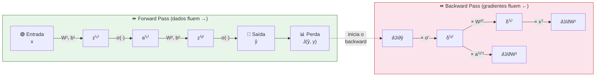

# Aula 34 — Backpropagation

> **Módulo 07 · Redes Neurais Artificiais** | ⏱ 45 minutos

## Objetivos de Aprendizagem
- Compreender a regra da cadeia aplicada a redes neurais
- Derivar o algoritmo de backpropagation para uma MLP simples
- Entender o papel dos gradientes no treinamento
- Calcular manualmente o forward e backward pass com valores numéricos
- Identificar e diagnosticar problemas de gradiente

---

## 1. O Problema

Queremos calcular $\frac{\partial J}{\partial w_{jk}^{(l)}}$ para **todos** os pesos da rede. O backpropagation faz isso eficientemente usando a regra da cadeia.

Numa rede com milhares (ou milhões) de pesos, calcular cada derivada parcial isoladamente seria computacionalmente inviável. Precisamos de um algoritmo que **reaproveite cálculos intermediários** — e é exatamente isso que o backpropagation faz.

---

## 1.1 Analogia Intuitiva — O GPS Recalculando a Rota

> 🗺️ **Imagine que você está dirigindo com um GPS.**

Você quer ir de São Paulo a Belo Horizonte, mas errou uma saída. O GPS não recalcula a rota inteira desde São Paulo — ele parte de **onde você está agora** (o erro) e ajusta apenas o trecho restante, **de trás para frente**.

O backpropagation funciona da mesma forma:

| GPS | Backpropagation |
|-----|-----------------|
| Destino desejado | Valor esperado ($y$) |
| Posição atual | Saída da rede ($\hat{y}$) |
| Erro de rota | Função de perda ($J$) |
| Recalcular trecho por trecho | Propagar gradientes camada por camada |
| Ajustar direção | Atualizar pesos ($w \leftarrow w - \eta \nabla J$) |

Assim como o GPS propaga a correção da posição atual até as próximas curvas, o backpropagation propaga o erro da saída até os pesos das primeiras camadas.

---

## 1.2 Por que a Regra da Cadeia Funciona — Intuição

A regra da cadeia diz que, se $y = f(g(x))$, então:

$$\frac{dy}{dx} = \frac{dy}{dg} \cdot \frac{dg}{dx}$$

**Intuição:** Pense em engrenagens conectadas. Se a engrenagem A gira e move a B, que move a C, o efeito total de girar A sobre C é o **produto** dos efeitos intermediários.

Numa rede neural, cada camada é uma "engrenagem":
- A entrada $x$ afeta $z^{(1)}$, que afeta $a^{(1)}$, que afeta $z^{(2)}$, ... até chegar na perda $J$.
- Para saber o efeito de um peso sobre $J$, multiplicamos as derivadas parciais ao longo de todo o caminho.

> 💡 **O backpropagation é simplesmente a regra da cadeia aplicada de forma organizada e eficiente, da saída para a entrada.**

---

## 2. Visão Geral do Fluxo — Forward e Backward

O diagrama abaixo mostra como os dados fluem para frente (forward) e os gradientes fluem para trás (backward):



### Forward Pass

Para cada camada $l$:
$$\mathbf{z}^{(l)} = \mathbf{W}^{(l)}\mathbf{a}^{(l-1)} + \mathbf{b}^{(l)}$$
$$\mathbf{a}^{(l)} = f^{(l)}(\mathbf{z}^{(l)})$$

> ⚠️ **Importante:** Durante o forward pass, guardamos todos os valores intermediários ($z^{(l)}$ e $a^{(l)}$) na memória — eles serão necessários no backward pass.

---

## 3. Backward Pass — Regra da Cadeia

**Erro na camada de saída (L):**
$$\boldsymbol{\delta}^{(L)} = \nabla_{\mathbf{a}}J \odot f'^{(L)}(\mathbf{z}^{(L)})$$

**Propagação do erro para camadas anteriores:**
$$\boldsymbol{\delta}^{(l)} = \left(\mathbf{W}^{(l+1)T}\boldsymbol{\delta}^{(l+1)}\right) \odot f'^{(l)}(\mathbf{z}^{(l)})$$

**Gradientes dos pesos:**
$$\frac{\partial J}{\partial \mathbf{W}^{(l)}} = \boldsymbol{\delta}^{(l)}\mathbf{a}^{(l-1)T}$$

---

## 3.1 🧾 Receita Visual — Algoritmo Passo a Passo

O backpropagation pode ser resumido nesta receita:

> **📋 Algoritmo Backpropagation**
>
> 1. **Inicializar** pesos $W$ e biases $b$ aleatoriamente (ex: Xavier)
> 2. **Forward Pass** — para cada exemplo de treino:
>    - 2a. Calcular $z^{(l)} = W^{(l)} a^{(l-1)} + b^{(l)}$ para cada camada
>    - 2b. Calcular $a^{(l)} = f(z^{(l)})$ — aplicar ativação
>    - 2c. Guardar $z^{(l)}$ e $a^{(l)}$ na memória
> 3. **Calcular a perda** $J(\hat{y}, y)$
> 4. **Backward Pass** — da última camada para a primeira:
>    - 4a. Calcular $\delta^{(L)}$ na camada de saída
>    - 4b. Para $l = L-1, L-2, \ldots, 1$: calcular $\delta^{(l)} = (W^{(l+1)T} \delta^{(l+1)}) \odot f'(z^{(l)})$
>    - 4c. Calcular gradientes: $\frac{\partial J}{\partial W^{(l)}} = \delta^{(l)} a^{(l-1)T}$
> 5. **Atualizar pesos:** $W^{(l)} \leftarrow W^{(l)} - \eta \frac{\partial J}{\partial W^{(l)}}$
> 6. **Repetir** passos 2–5 por $N$ épocas

---

## 3.2 🔢 Exemplo Numérico Completo

Vamos fazer o backpropagation **na mão**, com números reais, para uma rede com **2 entradas, 2 neurônios ocultos e 1 saída**.

### Arquitetura

```
Entrada (x₁, x₂) → [h₁, h₂] → [o₁] → perda J
```

### Dados Iniciais

| Componente | Valor |
|-----------|-------|
| Entrada | $x_1 = 0.5, \; x_2 = 0.8$ |
| Alvo | $y = 1$ |
| Pesos camada 1 | $w_{11}=0.4, \; w_{12}=0.3, \; w_{21}=0.5, \; w_{22}=0.7$ |
| Biases camada 1 | $b_1=0.1, \; b_2=0.2$ |
| Pesos camada 2 | $v_1=0.6, \; v_2=0.9$ |
| Bias camada 2 | $b_3=0.1$ |
| Ativação | Sigmoid: $\sigma(z) = \frac{1}{1+e^{-z}}$ |
| Perda | MSE: $J = \frac{1}{2}(\hat{y} - y)^2$ |
| Taxa de aprendizado | $\eta = 0.5$ |

### 🔵 Passo 1 — Forward Pass

**Camada oculta:**

$$z_{h1} = w_{11} \cdot x_1 + w_{21} \cdot x_2 + b_1 = 0.4 \times 0.5 + 0.5 \times 0.8 + 0.1 = 0.70$$

$$a_{h1} = \sigma(0.70) = \frac{1}{1+e^{-0.70}} \approx 0.6682$$

$$z_{h2} = w_{12} \cdot x_1 + w_{22} \cdot x_2 + b_2 = 0.3 \times 0.5 + 0.7 \times 0.8 + 0.2 = 0.91$$

$$a_{h2} = \sigma(0.91) = \frac{1}{1+e^{-0.91}} \approx 0.7133$$

**Camada de saída:**

$$z_o = v_1 \cdot a_{h1} + v_2 \cdot a_{h2} + b_3 = 0.6 \times 0.6682 + 0.9 \times 0.7133 + 0.1$$

$$z_o = 0.4009 + 0.6420 + 0.1 = 1.1429$$

$$\hat{y} = \sigma(1.1429) \approx 0.7583$$

**Perda:**

$$J = \frac{1}{2}(\hat{y} - y)^2 = \frac{1}{2}(0.7583 - 1)^2 = \frac{1}{2}(0.0584) = 0.0292$$

### 🔴 Passo 2 — Backward Pass

**Etapa 2a — Gradiente da saída:**

$$\frac{\partial J}{\partial \hat{y}} = \hat{y} - y = 0.7583 - 1 = -0.2417$$

$$\delta_o = \frac{\partial J}{\partial \hat{y}} \cdot \sigma'(z_o) = -0.2417 \times \hat{y}(1-\hat{y}) = -0.2417 \times 0.7583 \times 0.2417$$

$$\delta_o = -0.2417 \times 0.1833 \approx -0.0443$$

**Etapa 2b — Gradientes dos pesos da camada 2:**

$$\frac{\partial J}{\partial v_1} = \delta_o \cdot a_{h1} = -0.0443 \times 0.6682 \approx -0.0296$$

$$\frac{\partial J}{\partial v_2} = \delta_o \cdot a_{h2} = -0.0443 \times 0.7133 \approx -0.0316$$

$$\frac{\partial J}{\partial b_3} = \delta_o = -0.0443$$

**Etapa 2c — Propagação do erro para a camada oculta:**

$$\delta_{h1} = (\delta_o \cdot v_1) \cdot \sigma'(z_{h1}) = (-0.0443 \times 0.6) \times a_{h1}(1 - a_{h1})$$

$$\delta_{h1} = -0.0266 \times 0.6682 \times 0.3318 = -0.0266 \times 0.2217 \approx -0.0059$$

$$\delta_{h2} = (\delta_o \cdot v_2) \cdot \sigma'(z_{h2}) = (-0.0443 \times 0.9) \times a_{h2}(1 - a_{h2})$$

$$\delta_{h2} = -0.0399 \times 0.7133 \times 0.2867 = -0.0399 \times 0.2045 \approx -0.0082$$

**Etapa 2d — Gradientes dos pesos da camada 1:**

$$\frac{\partial J}{\partial w_{11}} = \delta_{h1} \cdot x_1 = -0.0059 \times 0.5 \approx -0.0030$$

$$\frac{\partial J}{\partial w_{21}} = \delta_{h1} \cdot x_2 = -0.0059 \times 0.8 \approx -0.0047$$

$$\frac{\partial J}{\partial w_{12}} = \delta_{h2} \cdot x_1 = -0.0082 \times 0.5 \approx -0.0041$$

$$\frac{\partial J}{\partial w_{22}} = \delta_{h2} \cdot x_2 = -0.0082 \times 0.8 \approx -0.0065$$

### 🟢 Passo 3 — Atualização dos Pesos

$$v_1' = v_1 - \eta \cdot \frac{\partial J}{\partial v_1} = 0.6 - 0.5 \times (-0.0296) = 0.6 + 0.0148 = \mathbf{0.6148}$$

$$v_2' = v_2 - \eta \cdot \frac{\partial J}{\partial v_2} = 0.9 - 0.5 \times (-0.0316) = 0.9 + 0.0158 = \mathbf{0.9158}$$

$$w_{11}' = 0.4 - 0.5 \times (-0.0030) = \mathbf{0.4015}$$

$$w_{12}' = 0.3 - 0.5 \times (-0.0041) = \mathbf{0.3020}$$

$$w_{21}' = 0.5 - 0.5 \times (-0.0047) = \mathbf{0.5024}$$

$$w_{22}' = 0.7 - 0.5 \times (-0.0065) = \mathbf{0.7033}$$

> ✅ **Observe:** Todos os pesos aumentaram ligeiramente. Isso faz sentido porque a rede estava prevendo 0.7583 quando o alvo era 1.0 — os gradientes negativos indicam que devemos **aumentar** as ativações, e portanto os pesos.

### Verificação em código

```python
import numpy as np

def sigma(z):
    return 1 / (1 + np.exp(-z))

# Dados
x = np.array([0.5, 0.8])
y = 1.0
W1 = np.array([[0.4, 0.3], [0.5, 0.7]])  # Shape: (n_inputs, n_hidden)
b1 = np.array([0.1, 0.2])
W2 = np.array([0.6, 0.9])
b2 = 0.1
eta = 0.5

# Forward
z_h = W1.T @ x + b1               # [0.70, 0.91]
a_h = sigma(z_h)                   # [0.6682, 0.7133]
z_o = W2 @ a_h + b2                # 1.1429
y_hat = sigma(z_o)                 # 0.7583
J = 0.5 * (y_hat - y)**2           # 0.0292

# Backward
delta_o = (y_hat - y) * y_hat * (1 - y_hat)   # -0.0443
dW2 = delta_o * a_h                             # [-0.0296, -0.0316]
delta_h = (delta_o * W2) * a_h * (1 - a_h)     # [-0.0059, -0.0082]
dW1 = np.outer(x, delta_h)                      # gradientes de W1

print(f"ŷ = {y_hat:.4f}, J = {J:.4f}")
print(f"δ_o = {delta_o:.4f}")
print(f"∂J/∂W2 = {dW2}")
print(f"δ_h = {delta_h}")
print(f"∂J/∂W1 =\n{dW1}")
print(f"\nPesos atualizados:")
print(f"W2' = {W2 - eta * dW2}")
print(f"W1' =\n{W1 - eta * dW1.T}")
```

---

## 4. Implementação do Zero (1 camada oculta)

```python
import numpy as np

def sigmoid(z):
    return 1 / (1 + np.exp(-z))

def sigmoid_derivative(a):
    return a * (1 - a)

class SimpleNN:
    def __init__(self, n_input, n_hidden, n_output, lr=0.01):
        self.lr = lr
        # Inicialização Xavier
        self.W1 = np.random.randn(n_input,  n_hidden) * np.sqrt(2/n_input)
        self.b1 = np.zeros((1, n_hidden))
        self.W2 = np.random.randn(n_hidden, n_output) * np.sqrt(2/n_hidden)
        self.b2 = np.zeros((1, n_output))

    def forward(self, X):
        self.z1 = X  @ self.W1 + self.b1
        self.a1 = sigmoid(self.z1)
        self.z2 = self.a1 @ self.W2 + self.b2
        self.a2 = sigmoid(self.z2)
        return self.a2

    def backward(self, X, y, y_hat):
        m = X.shape[0]
        # Gradiente da saída
        delta2 = (y_hat - y) * sigmoid_derivative(y_hat)
        dW2 = self.a1.T @ delta2 / m
        db2 = delta2.mean(axis=0, keepdims=True)
        # Propagação
        delta1 = (delta2 @ self.W2.T) * sigmoid_derivative(self.a1)
        dW1 = X.T @ delta1 / m
        db1 = delta1.mean(axis=0, keepdims=True)
        # Atualização
        self.W2 -= self.lr * dW2
        self.b2 -= self.lr * db2
        self.W1 -= self.lr * dW1
        self.b1 -= self.lr * db1

    def train(self, X, y, epochs=1000):
        losses = []
        for epoch in range(epochs):
            y_hat = self.forward(X)
            loss  = -np.mean(y * np.log(y_hat + 1e-8) + (1-y) * np.log(1 - y_hat + 1e-8))
            losses.append(loss)
            self.backward(X, y, y_hat)
            if epoch % 100 == 0:
                acc = ((y_hat > 0.5).astype(int) == y).mean()
                print(f"Epoch {epoch:4d} | Loss: {loss:.4f} | Acc: {acc:.4f}")
        return losses

# XOR
X_xor = np.array([[0,0],[0,1],[1,0],[1,1]])
y_xor = np.array([[0],[1],[1],[0]])

nn = SimpleNN(2, 4, 1, lr=0.5)
losses = nn.train(X_xor, y_xor, epochs=5000)
preds = (nn.forward(X_xor) > 0.5).astype(int)
print("XOR predições:", preds.ravel())
print("Esperado:     ", y_xor.ravel())
```

---

## 5. Problemas de Gradiente

| Problema | Causa | Solução |
|---------|-------|---------|
| Gradientes explodindo | Pesos muito grandes | Gradient clipping, BN |
| Gradientes sumindo | Ativações saturadas | ReLU, LSTM, ResNet |
| Convergência lenta | LR inadequado | Adam, LR scheduling |

### 5.1 Diagrama — Gradientes Sumindo vs. Explodindo

```mermaid
flowchart TB
    subgraph Saudavel["✅ Gradientes Saudáveis"]
        direction LR
        S1["Camada 1<br/>|∇| = 0.50"] --> S2["Camada 2<br/>|∇| = 0.45"]
        S2 --> S3["Camada 3<br/>|∇| = 0.40"]
        S3 --> S4["Camada 4<br/>|∇| = 0.38"]
    end

    subgraph Sumindo["❌ Gradientes Sumindo (Vanishing)"]
        direction LR
        V1["Camada 1<br/>|∇| = 0.001"] --> V2["Camada 2<br/>|∇| = 0.01"]
        V2 --> V3["Camada 3<br/>|∇| = 0.10"]
        V3 --> V4["Camada 4<br/>|∇| = 0.50"]
    end

    subgraph Explodindo["💥 Gradientes Explodindo"]
        direction LR
        E1["Camada 1<br/>|∇| = 1500"] --> E2["Camada 2<br/>|∇| = 150"]
        E2 --> E3["Camada 3<br/>|∇| = 15"]
        E3 --> E4["Camada 4<br/>|∇| = 1.5"]
    end

    style Saudavel fill:#e8f5e9,stroke:#2e7d32
    style Sumindo fill:#fff3e0,stroke:#e65100
    style Explodindo fill:#fce4ec,stroke:#c62828
```



**Por que o Sigmoid causa gradientes sumindo?**

A derivada do sigmoid é $\sigma'(z) = \sigma(z)(1-\sigma(z))$, cujo **valor máximo é 0.25** (quando $z=0$). Em cada camada, o gradiente é multiplicado por um valor $\leq 0.25$. Em 10 camadas:

$$|\nabla| \propto 0.25^{10} = 0.25^{10} \approx 0.0000001$$

> O sinal praticamente desaparece! É como passar uma mensagem pelo "telefone sem fio" — a cada pessoa (camada), a mensagem perde informação.

**Soluções na prática:**
- **ReLU** ($f(z) = \max(0, z)$): derivada é 0 ou 1, sem "encolhimento"
- **Residual connections (ResNet)**: criam "atalhos" para o gradiente fluir diretamente
- **Batch Normalization**: mantém as ativações numa faixa com gradientes saudáveis

---

## 6. Visualizando os Gradientes

O código abaixo treina uma rede e plota a **magnitude dos gradientes** em cada camada ao longo do treino. Isso ajuda a diagnosticar problemas de gradientes sumindo ou explodindo.

```python
import numpy as np
import matplotlib.pyplot as plt

def sigmoid(z):
    return 1 / (1 + np.exp(-z))

def relu(z):
    return np.maximum(0, z)

def sigmoid_grad(a):
    return a * (1 - a)

def relu_grad(z):
    return (z > 0).astype(float)

def train_and_track_gradients(n_layers=5, activation='sigmoid', epochs=500):
    """Treina uma rede profunda e registra a magnitude dos gradientes por camada."""
    np.random.seed(42)
    n = 8  # neurônios por camada

    # Dados sintéticos
    X = np.random.randn(100, n)
    y = (X[:, 0] > 0).astype(float).reshape(-1, 1)

    # Inicializar pesos
    weights = []
    biases = []
    for i in range(n_layers):
        n_in = n
        n_out = n if i < n_layers - 1 else 1
        w = np.random.randn(n_in, n_out) * 0.5
        b = np.zeros((1, n_out))
        weights.append(w)
        biases.append(b)

    act = sigmoid if activation == 'sigmoid' else relu
    act_grad = sigmoid_grad if activation == 'sigmoid' else relu_grad
    lr = 0.01

    grad_history = {f'Camada {i+1}': [] for i in range(n_layers)}

    for epoch in range(epochs):
        # Forward
        activations = [X]
        z_values = []
        a = X
        for i in range(n_layers):
            z = a @ weights[i] + biases[i]
            z_values.append(z)
            if i == n_layers - 1:
                a = sigmoid(z)  # saída sempre sigmoid
            else:
                a = act(z)
            activations.append(a)

        # Perda (MSE)
        y_hat = activations[-1]
        loss = np.mean((y_hat - y) ** 2)

        # Backward
        delta = (y_hat - y) * sigmoid_grad(y_hat)
        for i in reversed(range(n_layers)):
            dW = activations[i].T @ delta / X.shape[0]
            grad_history[f'Camada {i+1}'].append(np.mean(np.abs(dW)))
            if i > 0:
                delta = (delta @ weights[i].T)
                if activation == 'sigmoid':
                    delta *= sigmoid_grad(activations[i])
                else:
                    delta *= relu_grad(z_values[i-1])
            weights[i] -= lr * dW

    # Plotar
    plt.figure(figsize=(10, 5))
    for layer_name, grads in grad_history.items():
        plt.plot(grads, label=layer_name)
    plt.xlabel('Época')
    plt.ylabel('|Gradiente| médio')
    plt.title(f'Magnitude dos Gradientes — {activation.upper()} ({n_layers} camadas)')
    plt.legend()
    plt.yscale('log')
    plt.grid(True, alpha=0.3)
    plt.tight_layout()
    plt.savefig('gradientes_por_camada.png', dpi=150)
    plt.show()
    print(f"Gradiente final camada 1: {grad_history['Camada 1'][-1]:.6f}")
    print(f"Gradiente final camada {n_layers}: {grad_history[f'Camada {n_layers}'][-1]:.6f}")

# Compare Sigmoid vs ReLU
print("=== SIGMOID (gradientes tendem a sumir) ===")
train_and_track_gradients(n_layers=5, activation='sigmoid')

print("\n=== ReLU (gradientes mais estáveis) ===")
train_and_track_gradients(n_layers=5, activation='relu')
```

> 📊 **O que observar:** Com sigmoid, os gradientes da Camada 1 ficam ordens de magnitude menores que os da Camada 5. Com ReLU, as magnitudes ficam mais próximas entre camadas.

---

## 7. Exercícios Práticos

### Exercício 1 — Fácil 🟢

**Forward pass manual**

Considere uma rede com 1 neurônio, sem bias, com peso $w = 0.3$, entrada $x = 2.0$, ativação sigmoid, e alvo $y = 1$.

a) Calcule a saída $\hat{y} = \sigma(w \cdot x)$

b) Calcule a perda MSE: $J = \frac{1}{2}(\hat{y} - y)^2$

c) Calcule $\frac{\partial J}{\partial w}$

d) Atualize o peso com $\eta = 1.0$

<details>
<summary>💡 Solução</summary>

a) $z = 0.3 \times 2.0 = 0.6$, $\hat{y} = \sigma(0.6) = \frac{1}{1+e^{-0.6}} \approx 0.6457$

b) $J = \frac{1}{2}(0.6457 - 1)^2 = \frac{1}{2}(0.1255) \approx 0.0628$

c) $\frac{\partial J}{\partial w} = (\hat{y} - y) \cdot \sigma'(z) \cdot x = (0.6457 - 1) \times 0.6457 \times 0.3543 \times 2.0$
   $= -0.3543 \times 0.2287 \times 2.0 \approx -0.1621$

d) $w' = 0.3 - 1.0 \times (-0.1621) = 0.3 + 0.1621 = \mathbf{0.4621}$

> O peso aumentou, empurrando a saída para mais perto de 1.0. ✅
</details>

---

### Exercício 2 — Médio 🟡

**Backpropagation com 2 camadas**

Usando a rede do exemplo numérico da seção 3.2, mas com entrada $x_1 = 1.0, x_2 = 0.0$ e alvo $y = 0$:

a) Calcule o forward pass completo ($z_{h1}, a_{h1}, z_{h2}, a_{h2}, z_o, \hat{y}$)

b) Calcule o backward pass: $\delta_o$, $\frac{\partial J}{\partial v_1}$, $\frac{\partial J}{\partial v_2}$

c) Calcule $\delta_{h1}$ e $\delta_{h2}$

d) Todos os pesos devem aumentar ou diminuir? Justifique.

<details>
<summary>💡 Solução</summary>

a) **Forward:**
- $z_{h1} = 0.4 \times 1.0 + 0.5 \times 0.0 + 0.1 = 0.50$, $a_{h1} = \sigma(0.50) \approx 0.6225$
- $z_{h2} = 0.3 \times 1.0 + 0.7 \times 0.0 + 0.2 = 0.50$, $a_{h2} = \sigma(0.50) \approx 0.6225$
- $z_o = 0.6 \times 0.6225 + 0.9 \times 0.6225 + 0.1 = 0.3735 + 0.5602 + 0.1 = 1.0337$
- $\hat{y} = \sigma(1.0337) \approx 0.7377$

b) **Backward (MSE, alvo = 0):**
- $\delta_o = (\hat{y} - y) \cdot \hat{y}(1-\hat{y}) = 0.7377 \times 0.7377 \times 0.2623 \approx 0.1428$
- $\frac{\partial J}{\partial v_1} = 0.1428 \times 0.6225 \approx 0.0889$
- $\frac{\partial J}{\partial v_2} = 0.1428 \times 0.6225 \approx 0.0889$

c) **Propagação:**
- $\delta_{h1} = (0.1428 \times 0.6) \times 0.6225 \times 0.3775 \approx 0.0201$
- $\delta_{h2} = (0.1428 \times 0.9) \times 0.6225 \times 0.3775 \approx 0.0302$

d) Os pesos devem **diminuir**, pois a rede está prevendo 0.7377 quando o alvo é 0.0. Os gradientes são positivos, então $w' = w - \eta \cdot (\text{gradiente positivo})$ resulta em valores menores.
</details>

---

### Exercício 3 — Difícil 🔴

**Diagnóstico de gradientes em rede profunda**

Execute o código abaixo e responda:

```python
import numpy as np

np.random.seed(0)
n_layers = 10
n = 16
gradient_magnitudes = []

# Simular propagação de gradientes com sigmoid
delta = np.random.randn(1, n)
for i in range(n_layers):
    W = np.random.randn(n, n) * 0.5
    a = np.random.uniform(0.3, 0.7, (1, n))  # ativações típicas do sigmoid
    sig_deriv = a * (1 - a)                    # derivada sigmoid
    delta = (delta @ W.T) * sig_deriv
    gradient_magnitudes.append(np.mean(np.abs(delta)))

for i, mag in enumerate(gradient_magnitudes):
    print(f"Camada {10-i:2d}: |gradiente| = {mag:.8f}")
```

a) O que acontece com a magnitude dos gradientes à medida que retrocedemos mais camadas?

b) Se trocarmos `* 0.5` por `* 2.0` na inicialização dos pesos, o que muda?

c) Proponha uma alteração no código para usar ReLU em vez de sigmoid. O que acontece com os gradientes?

d) Explique por que a inicialização de Xavier ($W \sim \mathcal{N}(0, 1/n)$) ajuda a resolver o problema.

<details>
<summary>💡 Solução</summary>

a) Os gradientes diminuem exponencialmente. Na camada 1 (mais distante da saída), o gradiente é dezenas ou centenas de vezes menor que na camada 10.

b) Com `* 2.0`, os pesos são maiores. Os gradientes podem **explodir** em vez de sumir, crescendo exponencialmente.

c) Para usar ReLU:
```python
z = np.random.randn(1, n)
relu_deriv = (z > 0).astype(float)  # derivada: 0 ou 1
delta = (delta @ W.T) * relu_deriv
```
Com ReLU, a derivada é 0 ou 1 (sem "encolhimento"), então os gradientes se mantêm mais estáveis.

d) A inicialização Xavier define $\text{Var}(w) = \frac{1}{n_{in}}$, de modo que a variância das ativações é preservada camada a camada. Isso evita que o produto encadeado de matrizes no backward pass encolha ou cresça sistematicamente. Matematicamente, para preservar a variância: $\text{Var}(z) = n_{in} \cdot \text{Var}(w) \cdot \text{Var}(x) = 1 \cdot \text{Var}(x)$.
</details>

---

## Questões para Reflexão
1. Por que o Sigmoid causa o problema de gradientes que somem em redes profundas?
2. O que é a inicialização de Xavier/He e por que ela importa?
3. Como o mini-batch SGD difere do SGD estocástico puro?

## Referências
- Géron, cap. 11
- Faceli et al., cap. 7

---
*Próxima aula → [Aula 35: Otimizadores e Funções de Ativação](aula-35-otimizadores-funcoes-ativacao.md)*
