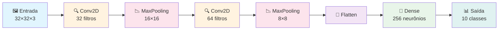
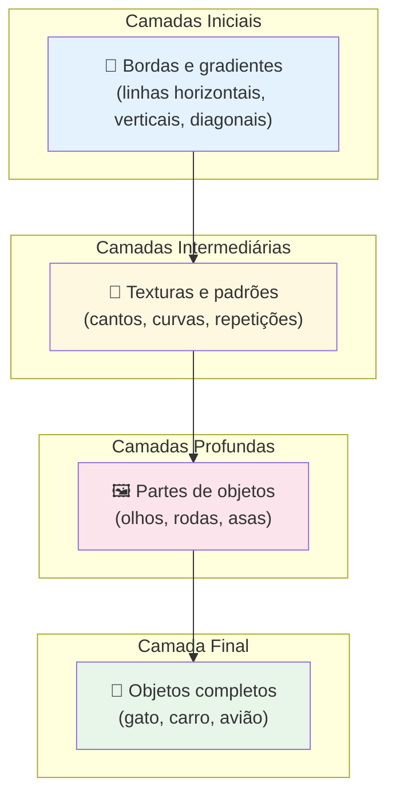

# Aula 47 — Redes Neurais Convolucionais (CNN)

> **Módulo 10 · Introdução ao Aprendizado Profundo** | ⏱ 45 minutos

## Objetivos de Aprendizagem
- Compreender operações de convolução, pooling e feature maps
- Implementar uma CNN para classificação de imagens com Keras
- Conhecer as arquiteturas clássicas (LeNet, AlexNet, VGG, ResNet)

---

## 1. Operação de Convolução

$$(\mathbf{I} * \mathbf{K})[i,j] = \sum_{m}\sum_{n} \mathbf{I}[i+m, j+n] \cdot \mathbf{K}[m,n]$$

- **Filtros (kernels)** aprendem detectores de features: bordas, texturas, formas
- **Feature maps**: saída da convolução — mapas de ativação
- **Parâmetro compartilhado**: o mesmo kernel varre toda a imagem (translation invariance)

### 🔍 Analogia Intuitiva

> Imagine que você está analisando uma fotografia com uma **lupa pequena** (o kernel).
> Você não olha a foto inteira de uma vez — em vez disso, **desliza a lupa**
> sistematicamente por cada região da imagem, da esquerda para a direita, de cima
> para baixo. Em cada posição, a lupa **detecta um padrão local**: uma borda,
> uma mudança de cor, uma textura. Ao final da varredura, você tem um **mapa completo**
> de onde cada padrão aparece na imagem. Isso é exatamente o que um filtro
> convolucional faz — e a CNN aprende **quais padrões procurar** automaticamente
> durante o treinamento!

### Convolução Passo a Passo (exemplo numérico)

Veja como um kernel 3×3 desliza sobre uma entrada 5×5 para produzir uma saída 3×3:

**Entrada (5×5):**

```
┌───┬───┬───┬───┬───┐
│ 1 │ 0 │ 1 │ 0 │ 2 │
├───┼───┼───┼───┼───┤
│ 0 │ 1 │ 2 │ 1 │ 0 │
├───┼───┼───┼───┼───┤
│ 1 │ 2 │ 1 │ 0 │ 1 │
├───┼───┼───┼───┼───┤
│ 0 │ 1 │ 0 │ 2 │ 1 │
├───┼───┼───┼───┼───┤
│ 2 │ 0 │ 1 │ 1 │ 0 │
└───┴───┴───┴───┴───┘
```

**Kernel (3×3):**

```
┌────┬────┬────┐
│  1 │  0 │ -1 │
├────┼────┼────┤
│  1 │  0 │ -1 │
├────┼────┼────┤
│  1 │  0 │ -1 │
└────┴────┴────┘
```

**Cálculo da posição [0, 0]** — kernel sobre o canto superior esquerdo:

```
(1×1) + (0×0) + (1×-1) +
(0×1) + (1×0) + (2×-1) +
(1×1) + (2×0) + (1×-1) = 1 + 0 - 1 + 0 + 0 - 2 + 1 + 0 - 1 = -2
```

**Cálculo da posição [0, 1]** — kernel desliza 1 pixel para a direita:

```
(0×1) + (1×0) + (0×-1) +
(1×1) + (2×0) + (1×-1) +
(2×1) + (1×0) + (0×-1) = 0 + 0 + 0 + 1 + 0 - 1 + 2 + 0 + 0 = 2
```

**Saída completa (3×3):**

```
┌────┬────┬────┐
│ -2 │  2 │ -2 │
├────┼────┼────┤
│  0 │  2 │ -2 │
├────┼────┼────┤
│  0 │ -1 │  1 │
└────┴────┴────┘
```

> 💡 Este kernel específico detecta **bordas verticais** — valores positivos indicam
> transição claro→escuro e negativos indicam escuro→claro.

---

## 2. Arquitetura CNN — Visão Geral



> As camadas convolucionais **extraem features** progressivamente mais complexas,
> o pooling **reduz a dimensionalidade** espacial e as camadas densas **classificam**
> com base nas features extraídas.

---

## 3. Camadas Principais

| Camada | Função |
|--------|--------|
| Conv2D | Extração de features locais |
| MaxPooling2D | Redução espacial (downsampling) |
| GlobalAveragePooling2D | Colapso espacial → vetor |
| BatchNormalization | Estabilização do treino |
| Dropout | Regularização |
| Dense | Classificação final |

### MaxPooling — Exemplo Visual

A operação **MaxPooling2D** com janela 2×2 e stride 2 seleciona o valor máximo de cada região:

```
Entrada (4×4):                        Saída (2×2):
┌────┬────┬────┬────┐                ┌────┬────┐
│  1 │  3 │  2 │  1 │                │    │    │
├────┼────┤────┼────┤   MaxPool 2×2  │  6 │  8 │
│  5 │  6 │  7 │  8 │  ───────────►  │    │    │
├────┼────┼────┼────┤                ├────┼────┤
│  2 │  4 │  1 │  3 │                │    │    │
├────┼────┤────┼────┤                │  4 │  5 │
│  0 │  1 │  5 │  2 │                │    │    │
└────┴────┴────┴────┘                └────┴────┘

Região superior-esquerda: max(1, 3, 5, 6) = 6
Região superior-direita:  max(2, 1, 7, 8) = 8
Região inferior-esquerda: max(2, 4, 0, 1) = 4
Região inferior-direita:  max(1, 3, 5, 2) = 5
```

> 💡 O MaxPooling reduz a resolução espacial pela metade (em cada dimensão),
> mantendo as ativações mais fortes. Isso torna a rede mais robusta a pequenas
> translações e reduz o custo computacional.

---

## 4. Como os Filtros Aprendem

Uma CNN aprende uma **hierarquia de features** — cada camada detecta padrões
progressivamente mais abstratos:



| Profundidade | O que o filtro detecta | Exemplo |
|---|---|---|
| **Camada 1** | Bordas simples e gradientes de cor | Linhas horizontais, verticais |
| **Camada 2–3** | Texturas e combinações de bordas | Cantos, curvas, padrões repetitivos |
| **Camada 4–5** | Partes de objetos | Olhos, rodas, janelas |
| **Camadas finais** | Objetos e conceitos completos | Rosto de gato, frente de carro |

> Essa hierarquia emerge **automaticamente** durante o treinamento via backpropagation —
> o programador não define o que cada filtro deve detectar.

---

## 5. Implementação — Classificação CIFAR-10

```python
import tensorflow as tf
import numpy as np
import matplotlib.pyplot as plt

(X_tr, y_tr), (X_te, y_te) = tf.keras.datasets.cifar10.load_data()
X_tr = X_tr.astype('float32') / 255.0
X_te = X_te.astype('float32') / 255.0

class_names = ['avião','automóvel','pássaro','gato','cervo',
               'cachorro','sapo','cavalo','navio','caminhão']

# Data augmentation
augment = tf.keras.Sequential([
    tf.keras.layers.RandomFlip('horizontal'),
    tf.keras.layers.RandomRotation(0.1),
    tf.keras.layers.RandomZoom(0.1),
])

# Modelo CNN
model = tf.keras.Sequential([
    tf.keras.layers.Input(shape=(32, 32, 3)),
    augment,

    # Bloco 1
    tf.keras.layers.Conv2D(32, 3, padding='same', activation='relu'),
    tf.keras.layers.BatchNormalization(),
    tf.keras.layers.Conv2D(32, 3, padding='same', activation='relu'),
    tf.keras.layers.MaxPooling2D(2),
    tf.keras.layers.Dropout(0.2),

    # Bloco 2
    tf.keras.layers.Conv2D(64, 3, padding='same', activation='relu'),
    tf.keras.layers.BatchNormalization(),
    tf.keras.layers.Conv2D(64, 3, padding='same', activation='relu'),
    tf.keras.layers.MaxPooling2D(2),
    tf.keras.layers.Dropout(0.3),

    # Bloco 3
    tf.keras.layers.Conv2D(128, 3, padding='same', activation='relu'),
    tf.keras.layers.BatchNormalization(),
    tf.keras.layers.GlobalAveragePooling2D(),
    tf.keras.layers.Dropout(0.4),

    # Classificador
    tf.keras.layers.Dense(256, activation='relu'),
    tf.keras.layers.Dropout(0.5),
    tf.keras.layers.Dense(10, activation='softmax')
])

model.compile(
    optimizer=tf.keras.optimizers.Adam(1e-3),
    loss='sparse_categorical_crossentropy',
    metrics=['accuracy']
)

model.summary()

callbacks = [
    tf.keras.callbacks.EarlyStopping(patience=10, restore_best_weights=True),
    tf.keras.callbacks.ReduceLROnPlateau(factor=0.5, patience=5)
]

history = model.fit(
    X_tr, y_tr, epochs=50, batch_size=128,
    validation_split=0.15, callbacks=callbacks, verbose=1
)

test_loss, test_acc = model.evaluate(X_te, y_te, verbose=0)
print(f"Acurácia no teste: {test_acc:.4f}")
```

### Visualizando os Filtros Aprendidos

Após o treinamento, podemos inspecionar o que a primeira camada convolucional aprendeu:

```python
# Extrair os pesos da primeira camada Conv2D
primeira_conv = None
for layer in model.layers:
    if isinstance(layer, tf.keras.layers.Conv2D):
        primeira_conv = layer
        break

filtros, biases = primeira_conv.get_weights()
print(f"Shape dos filtros: {filtros.shape}")  # (3, 3, 3, 32)

# Normalizar filtros para visualização no intervalo [0, 1]
f_min, f_max = filtros.min(), filtros.max()
filtros_norm = (filtros - f_min) / (f_max - f_min)

# Plotar os 32 filtros da primeira camada
fig, axes = plt.subplots(4, 8, figsize=(12, 6))
fig.suptitle('Filtros aprendidos — 1ª camada Conv2D', fontsize=14)

for i, ax in enumerate(axes.flat):
    if i < filtros_norm.shape[3]:
        ax.imshow(filtros_norm[:, :, :, i])
    ax.axis('off')

plt.tight_layout()
plt.savefig('filtros_primeira_camada.png', dpi=150)
plt.show()
```

> 💡 Observe que os filtros da primeira camada tipicamente se assemelham a
> **detectores de bordas** em diferentes orientações e cores — exatamente como
> previsto pela teoria da hierarquia de features.

---

## 6. Arquiteturas Famosas

| Arquitetura | Ano | Inovação |
|------------|-----|---------|
| LeNet-5 | 1998 | Primeira CNN prática (dígitos) |
| AlexNet | 2012 | ReLU, Dropout, GPU → ImageNet |
| VGG | 2014 | Kernels 3×3 empilhados |
| ResNet | 2015 | Skip connections (redes muito profundas) |
| EfficientNet | 2019 | Escalonamento composto |
| ViT | 2020 | Transformer para imagens |
| ConvNeXt | 2022 | CNN moderna inspirada em ViT |

---

## Exercícios Práticos

### Exercício 1 — Convolução Manual
Calcule manualmente a saída da convolução entre a entrada 4×4 e o kernel 3×3 abaixo.
Verifique seu resultado com NumPy (`scipy.signal.correlate2d`).

```
Entrada (4×4):          Kernel (3×3):
┌───┬───┬───┬───┐      ┌────┬────┬────┐
│ 2 │ 1 │ 0 │ 3 │      │  0 │  1 │  0 │
├───┼───┼───┼───┤      ├────┼────┼────┤
│ 1 │ 0 │ 1 │ 2 │      │  1 │ -4 │  1 │
├───┼───┼───┼───┤      ├────┼────┼────┤
│ 3 │ 2 │ 1 │ 0 │      │  0 │  1 │  0 │
├───┼───┼───┼───┤      └────┴────┴────┘
│ 0 │ 1 │ 3 │ 1 │
└───┴───┴───┴───┘
```

```python
import numpy as np
from scipy.signal import correlate2d

entrada = np.array([[2,1,0,3],[1,0,1,2],[3,2,1,0],[0,1,3,1]])
kernel  = np.array([[0,1,0],[1,-4,1],[0,1,0]])

saida = correlate2d(entrada, kernel, mode='valid')
print("Saída da convolução:\n", saida)
```

### Exercício 2 — Experimentando Arquiteturas
Modifique a CNN do CIFAR-10 para testar as seguintes variações e compare a
acurácia no conjunto de teste:

1. **Trocar MaxPooling2D por AveragePooling2D** — como isso afeta a acurácia?
2. **Remover BatchNormalization** — o treinamento fica mais lento ou instável?
3. **Aumentar para 4 blocos convolucionais** — melhora o desempenho?

Registre os resultados em uma tabela:

```python
# Dica: crie uma função que constrói o modelo com parâmetros configuráveis
def criar_modelo(pooling='max', usar_batchnorm=True, num_blocos=3):
    layers = [tf.keras.layers.Input(shape=(32, 32, 3))]
    filtros = 32
    for i in range(num_blocos):
        layers.append(tf.keras.layers.Conv2D(filtros, 3, padding='same', activation='relu'))
        if usar_batchnorm:
            layers.append(tf.keras.layers.BatchNormalization())
        pool = tf.keras.layers.MaxPooling2D(2) if pooling == 'max' else tf.keras.layers.AveragePooling2D(2)
        layers.append(pool)
        layers.append(tf.keras.layers.Dropout(0.2 + i * 0.1))
        filtros *= 2
    layers.extend([
        tf.keras.layers.GlobalAveragePooling2D(),
        tf.keras.layers.Dense(256, activation='relu'),
        tf.keras.layers.Dropout(0.5),
        tf.keras.layers.Dense(10, activation='softmax')
    ])
    return tf.keras.Sequential(layers)
```

### Exercício 3 — Visualizando Feature Maps
Escolha uma imagem do CIFAR-10 e visualize os feature maps produzidos por cada
bloco convolucional. Quais camadas detectam bordas? Quais capturam padrões mais
abstratos?

```python
# Modelo intermediário que retorna as saídas de cada camada Conv2D
conv_outputs = [layer.output for layer in model.layers if isinstance(layer, tf.keras.layers.Conv2D)]
modelo_vis = tf.keras.Model(inputs=model.input, outputs=conv_outputs)

# Escolher uma imagem de teste
img = X_te[0:1]  # shape (1, 32, 32, 3)
feature_maps = modelo_vis.predict(img)

# Plotar os primeiros 8 feature maps de cada camada
for idx, fmap in enumerate(feature_maps):
    fig, axes = plt.subplots(1, 8, figsize=(16, 2))
    fig.suptitle(f'Feature maps — Conv2D camada {idx+1}', fontsize=12)
    for i in range(8):
        axes[i].imshow(fmap[0, :, :, i], cmap='viridis')
        axes[i].axis('off')
    plt.tight_layout()
    plt.show()
```

---

## Questões para Reflexão
1. Por que kernels 3×3 são preferidos a kernels maiores em redes modernas?
2. O que é o problema do gradiente que sumiu em redes profundas e como o ResNet resolve?
3. Para que serve o GlobalAveragePooling2D em vez de Flatten?

## Referências
- Géron, cap. 14
- Faceli et al., cap. 7

---
*Próxima aula → [Aula 48: RNNs, LSTMs e GRUs](aula-48-rnn-lstm.md)*
