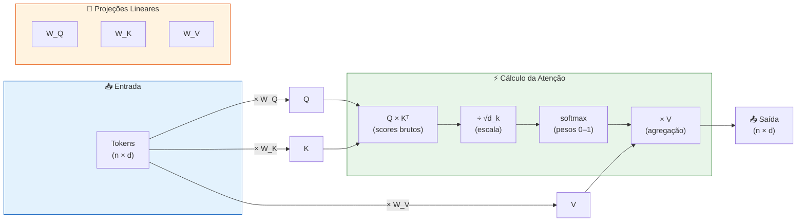
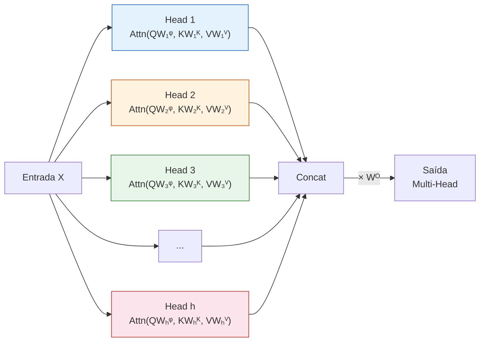

# Aula 49 — Mecanismo de Atenção e Transformers

> **Módulo 10 · Introdução ao Aprendizado Profundo** | ⏱ 45 minutos

## Objetivos de Aprendizagem
- Compreender o mecanismo de self-attention e multi-head attention
- Entender a arquitetura Transformer (encoder-decoder)
- Conhecer modelos BERT, GPT e sua relação com o Transformer
- Calcular manualmente self-attention com valores numéricos
- Explicar por que o Transformer precisa de positional encodings
- Identificar marcos históricos na evolução dos Transformers

---

## 1. Motivação: O Problema do Gargalo

Em Seq2Seq com LSTM, toda a informação da sequência de entrada é comprimida em **um único vetor** (encoder final state). Isso é problemático para sequências longas.

**Atenção:** em vez de usar apenas o estado final, a atenção usa **todos os estados do encoder** e aprende quais são mais relevantes para cada posição da saída.

---

## 1.1 Analogia Intuitiva — Ler um Livro com Marca-Texto

> 📖 **Imagine que você está lendo um livro e precisa responder uma pergunta sobre o capítulo.**

Você não relê o capítulo inteiro com a mesma atenção. Em vez disso, seus olhos **passam rapidamente** pelo texto e **destacam** as palavras e frases mais relevantes para a pergunta. As partes irrelevantes recebem pouca atenção.

O mecanismo de atenção funciona da mesma forma:

| Leitura com marca-texto | Mecanismo de Atenção |
|--------------------------|----------------------|
| A pergunta que você quer responder | **Query** (Q) — o que estou procurando |
| Os títulos/palavras-chave de cada parágrafo | **Key** (K) — o que cada posição oferece |
| O conteúdo completo de cada parágrafo | **Value** (V) — a informação útil a extrair |
| Destacar as partes mais relevantes | **Softmax** — pesos de atenção (0 a 1) |
| Resumo mental das partes destacadas | **Saída** — soma ponderada dos Values |

Assim como um bom leitor distribui sua atenção de forma desigual — muito peso nas frases-chave, pouco peso no texto genérico — a self-attention aprende **quais tokens são mais relevantes** para cada posição da sequência.

> 💡 **Multi-head attention** é como ter vários leitores, cada um com um critério diferente de destaque: um procura sujeitos, outro procura verbos, outro procura relações temporais.

---

## 2. Scaled Dot-Product Attention

$$\text{Attention}(Q, K, V) = \text{softmax}\left(\frac{QK^T}{\sqrt{d_k}}\right)V$$

- **Q** (Queries): o que estou procurando
- **K** (Keys): o que cada posição oferece
- **V** (Values): o conteúdo que será agregado
- $\sqrt{d_k}$: escala para evitar gradientes pequenos

### 2.1 Diagrama do Fluxo Q/K/V



---

### 2.2 🔢 Exemplo Numérico Completo — Self-Attention Passo a Passo

Vamos calcular self-attention para **3 tokens** com dimensão $d = 4$. Para simplificar, usamos matrizes de projeção identidade ($W_Q = W_K = W_V = I$), ou seja, $Q = K = V = X$.

#### Dados de Entrada

Considere a frase "eu gosto flores" representada por 3 vetores:

$$X = \begin{bmatrix} 1 & 0 & 1 & 0 \\ 0 & 1 & 0 & 1 \\ 1 & 1 & 0 & 0 \end{bmatrix}$$

- Linha 0: "eu" = $[1, 0, 1, 0]$
- Linha 1: "gosto" = $[0, 1, 0, 1]$
- Linha 2: "flores" = $[1, 1, 0, 0]$

Como $W_Q = W_K = W_V = I$:

$$Q = K = V = X$$

#### 🔵 Passo 1 — Calcular Scores: $QK^T$

$$QK^T = X \cdot X^T = \begin{bmatrix} 1 & 0 & 1 & 0 \\ 0 & 1 & 0 & 1 \\ 1 & 1 & 0 & 0 \end{bmatrix} \times \begin{bmatrix} 1 & 0 & 1 \\ 0 & 1 & 1 \\ 1 & 0 & 0 \\ 0 & 1 & 0 \end{bmatrix}$$

Calculando elemento a elemento:

- $\text{score}(eu, eu) = 1 \cdot 1 + 0 \cdot 0 + 1 \cdot 1 + 0 \cdot 0 = 2$
- $\text{score}(eu, gosto) = 1 \cdot 0 + 0 \cdot 1 + 1 \cdot 0 + 0 \cdot 1 = 0$
- $\text{score}(eu, flores) = 1 \cdot 1 + 0 \cdot 1 + 1 \cdot 0 + 0 \cdot 0 = 1$
- $\text{score}(gosto, eu) = 0 \cdot 1 + 1 \cdot 0 + 0 \cdot 1 + 1 \cdot 0 = 0$
- $\text{score}(gosto, gosto) = 0 \cdot 0 + 1 \cdot 1 + 0 \cdot 0 + 1 \cdot 1 = 2$
- $\text{score}(gosto, flores) = 0 \cdot 1 + 1 \cdot 1 + 0 \cdot 0 + 1 \cdot 0 = 1$
- $\text{score}(flores, eu) = 1 \cdot 1 + 1 \cdot 0 + 0 \cdot 1 + 0 \cdot 0 = 1$
- $\text{score}(flores, gosto) = 1 \cdot 0 + 1 \cdot 1 + 0 \cdot 0 + 0 \cdot 1 = 1$
- $\text{score}(flores, flores) = 1 \cdot 1 + 1 \cdot 1 + 0 \cdot 0 + 0 \cdot 0 = 2$

$$QK^T = \begin{bmatrix} 2 & 0 & 1 \\ 0 & 2 & 1 \\ 1 & 1 & 2 \end{bmatrix}$$

#### 🟢 Passo 2 — Escalar por $\sqrt{d_k}$

$$d_k = 4 \implies \sqrt{d_k} = 2$$

$$\frac{QK^T}{\sqrt{d_k}} = \begin{bmatrix} 1.0 & 0.0 & 0.5 \\ 0.0 & 1.0 & 0.5 \\ 0.5 & 0.5 & 1.0 \end{bmatrix}$$

#### 🟡 Passo 3 — Aplicar Softmax (por linha)

Para a linha 0 ("eu"):

$$\text{softmax}([1.0,\ 0.0,\ 0.5]) = \frac{[e^{1.0},\ e^{0.0},\ e^{0.5}]}{e^{1.0} + e^{0.0} + e^{0.5}} = \frac{[2.718,\ 1.000,\ 1.649]}{5.367}$$

$$= [0.506,\ 0.186,\ 0.307]$$

Para a linha 1 ("gosto"):

$$\text{softmax}([0.0,\ 1.0,\ 0.5]) = [0.186,\ 0.506,\ 0.307]$$

Para a linha 2 ("flores"):

$$\text{softmax}([0.5,\ 0.5,\ 1.0]) = \frac{[1.649,\ 1.649,\ 2.718]}{6.016} = [0.274,\ 0.274,\ 0.452]$$

$$\text{Pesos} = \begin{bmatrix} 0.506 & 0.186 & 0.307 \\ 0.186 & 0.506 & 0.307 \\ 0.274 & 0.274 & 0.452 \end{bmatrix}$$

> 💡 **Interpretação:** "eu" presta 50.6% de atenção em si mesmo, 18.6% em "gosto" e 30.7% em "flores".

#### 🔴 Passo 4 — Multiplicar pelos Values

$$\text{Saída} = \text{Pesos} \times V$$

Para o token "eu" (linha 0):

$$\text{saída}_0 = 0.506 \times [1,0,1,0] + 0.186 \times [0,1,0,1] + 0.307 \times [1,1,0,0]$$

$$= [0.506, 0, 0.506, 0] + [0, 0.186, 0, 0.186] + [0.307, 0.307, 0, 0]$$

$$= [0.813,\ 0.494,\ 0.506,\ 0.186]$$

Para "gosto" (linha 1):

$$\text{saída}_1 = 0.186 \times [1,0,1,0] + 0.506 \times [0,1,0,1] + 0.307 \times [1,1,0,0]$$

$$= [0.494,\ 0.813,\ 0.186,\ 0.506]$$

Para "flores" (linha 2):

$$\text{saída}_2 = 0.274 \times [1,0,1,0] + 0.274 \times [0,1,0,1] + 0.452 \times [1,1,0,0]$$

$$= [0.726,\ 0.726,\ 0.274,\ 0.274]$$

$$\text{Saída final} = \begin{bmatrix} 0.813 & 0.494 & 0.506 & 0.186 \\ 0.494 & 0.813 & 0.186 & 0.506 \\ 0.726 & 0.726 & 0.274 & 0.274 \end{bmatrix}$$

> ✅ Cada linha da saída é uma **mistura ponderada** de todos os tokens de entrada. O token "flores" misturou informação igualmente de "eu" e "gosto" (ambos 27.4%) e manteve 45.2% de si mesmo.

---

### 2.3 Por que Dividir por $\sqrt{d_k}$? — Exemplo Concreto

A divisão por $\sqrt{d_k}$ é crucial. Sem ela, os scores podem ficar **muito grandes**, fazendo a softmax **saturar** — ou seja, toda a atenção vai para um único token.

#### Demonstração: $d_k = 64$

Suponha dois vetores $q$ e $k$ com $d_k = 64$, onde cada componente $\sim \mathcal{N}(0, 1)$.

O produto escalar $q \cdot k = \sum_{i=1}^{64} q_i k_i$ é a soma de 64 variáveis aleatórias, cada uma com variância 1.

- **Variância de $q \cdot k$** $= d_k = 64$
- **Desvio padrão** $= \sqrt{64} = 8$

Logo, os scores brutos podem facilmente atingir valores como $\pm 16$ ou mais.

**Sem escala:**

$$\text{softmax}([16,\ 1,\ 0]) = \frac{[e^{16},\ e^{1},\ e^{0}]}{e^{16} + e^1 + e^0} \approx \frac{[8.886.110,\ 2.718,\ 1]}{8.888.829} \approx [0.9997,\ 0.0003,\ 0.0000]$$

> ⚠️ Quase **100% da atenção** vai para um único token! Os gradientes de softmax ficam próximos de zero (saturação), tornando o treinamento **extremamente lento**.

**Com escala** ($\div \sqrt{64} = 8$):

$$\text{softmax}([2.0,\ 0.125,\ 0.0]) = [0.637,\ 0.195,\ 0.172]$$

> ✅ Os pesos ficam **mais distribuídos**, permitindo atenção a múltiplos tokens e gradientes saudáveis.

| | Sem $\div\sqrt{d_k}$ | Com $\div\sqrt{d_k}$ |
|---|---|---|
| Scores típicos | $\pm 16$ | $\pm 2$ |
| Softmax | ≈ one-hot | Distribuída |
| Gradientes | ≈ zero (saturação) | Saudáveis |
| Treinamento | Muito lento / instável | Estável |

---

## 3. Multi-Head Attention

Executa h atenções em paralelo em subespaços diferentes:
$$\text{MultiHead}(Q,K,V) = \text{Concat}(\text{head}_1,...,\text{head}_h)W^O$$
$$\text{head}_i = \text{Attention}(QW_i^Q, KW_i^K, VW_i^V)$$



> 💡 Se $d_{model} = 512$ e $h = 8$, cada head opera com $d_k = d_v = 512/8 = 64$. Cada head pode aprender um **tipo diferente** de relação: uma head pode focar em adjacência, outra em relações sujeito-verbo, outra em correferência.

---

## 4. Positional Encodings — O Transformer Não Sabe "Ordem"

Diferente de RNNs, o Transformer processa todos os tokens **em paralelo** — ele não tem noção inerente de ordem. Para a self-attention pura, "o gato comeu o rato" e "o rato comeu o gato" produziriam a **mesma saída**.

### 4.1 A Solução: Encodings de Posição

Adicionamos um vetor de posição a cada embedding de token **antes** de entrar no Transformer:

$$\text{input}_i = \text{embedding}_i + \text{PE}_i$$

O artigo original (Vaswani et al., 2017) usa funções **senoidais** com frequências diferentes para cada dimensão:

$$PE_{(pos, 2i)} = \sin\left(\frac{pos}{10000^{2i/d_{model}}}\right)$$

$$PE_{(pos, 2i+1)} = \cos\left(\frac{pos}{10000^{2i/d_{model}}}\right)$$

Onde:
- $pos$: posição do token na sequência (0, 1, 2, ...)
- $i$: índice da dimensão do embedding
- $d_{model}$: dimensão total do modelo

### 4.2 Visualização dos Positional Encodings

```
Posição →   0     1     2     3     4     5     ...
Dim 0  :  sin(0) sin(1) sin(2) sin(3) sin(4) sin(5)    ← frequência alta
Dim 1  :  cos(0) cos(1) cos(2) cos(3) cos(4) cos(5)
Dim 2  :  sin(0) sin(.01) sin(.02) ...                  ← frequência mais baixa
Dim 3  :  cos(0) cos(.01) cos(.02) ...
  ⋮         ⋮      ⋮      ⋮
Dim d-1:  cos(0) cos(~0) cos(~0)  ...                   ← frequência muito baixa
```

> 💡 **Intuição:** É como dar a cada posição um "código de barras" único feito de ondas. As primeiras dimensões variam rápido (diferenciando posições próximas), e as últimas variam lentamente (capturando a posição "global").

### 4.3 Por que Senoides Funcionam?

1. **Cada posição tem um vetor único** — o padrão de senos e cossenos cria uma "assinatura" distinta
2. **Distância relativa é capturável** — $PE_{pos+k}$ pode ser representado como uma transformação linear de $PE_{pos}$, permitindo que o modelo aprenda relações de distância
3. **Generaliza para sequências longas** — funciona para comprimentos não vistos no treino (ao contrário de embeddings aprendidos)

```python
import numpy as np

def positional_encoding(max_len, d_model):
    PE = np.zeros((max_len, d_model))
    position = np.arange(max_len)[:, np.newaxis]
    div_term = np.exp(np.arange(0, d_model, 2) * -(np.log(10000.0) / d_model))
    
    PE[:, 0::2] = np.sin(position * div_term)  # dimensões pares
    PE[:, 1::2] = np.cos(position * div_term)  # dimensões ímpares
    return PE

# Exemplo: 10 posições, 8 dimensões
PE = positional_encoding(10, 8)
print("PE para posição 0:", PE[0].round(3))
print("PE para posição 1:", PE[1].round(3))
print("PE para posição 9:", PE[9].round(3))
```

---

## 5. Arquitetura Transformer Completa

```
ENCODER:                          DECODER:
┌────────────────────────┐        ┌────────────────────────┐
│ Multi-Head Self-Attn   │        │ Masked Multi-Head Attn  │
│ Add & Norm             │        │ Add & Norm              │
│ Feed Forward           │   →    │ Cross-Attention          │
│ Add & Norm             │        │ Add & Norm              │
└────────────────────────┘        │ Feed Forward            │
  × N layers                      │ Add & Norm              │
                                  └────────────────────────┘
                                    × N layers
```

**Componentes-chave:**
- **Add & Norm**: conexão residual ($x + \text{sublayer}(x)$) seguida de Layer Normalization — estabiliza o treinamento
- **Feed Forward**: duas camadas lineares com ReLU: $\text{FFN}(x) = \max(0, xW_1 + b_1)W_2 + b_2$
- **Masked Attention**: no decoder, impede que posições futuras sejam "vistas" (necessário para geração autoregressiva)
- **Cross-Attention**: o decoder faz queries, mas Keys e Values vêm do **encoder** (conecta entrada e saída)

---

## 6. BERT vs. GPT

| Modelo | Tipo | Pre-training | Uso |
|--------|------|-------------|-----|
| BERT | Encoder | Masked Language Model | Classificação, NER, QA |
| GPT | Decoder | Causal Language Model | Geração de texto |
| T5 | Encoder-Decoder | Span corruption | Tradução, sumarização |
| BART | Encoder-Decoder | Denoising | Sumarização, geração |

---

## 7. Implementação Simplificada de Self-Attention

```python
import numpy as np

def scaled_dot_product_attention(Q, K, V, mask=None):
    d_k = Q.shape[-1]
    scores = Q @ K.transpose(-2, -1) / np.sqrt(d_k)
    
    if mask is not None:
        scores = scores + mask * (-1e9)
    
    weights = np.exp(scores) / np.exp(scores).sum(axis=-1, keepdims=True)
    output = weights @ V
    return output, weights

# Demonstração
np.random.seed(42)
seq_len = 5
d_model = 8

# Sequência de entrada (5 tokens, 8 dimensões)
X = np.random.randn(seq_len, d_model)

W_Q = np.random.randn(d_model, d_model)
W_K = np.random.randn(d_model, d_model)
W_V = np.random.randn(d_model, d_model)

Q = X @ W_Q
K = X @ W_K
V = X @ W_V

output, weights = scaled_dot_product_attention(Q, K, V)
print(f"Input shape: {X.shape}")
print(f"Output shape: {output.shape}")
print(f"Attention weights (token 0):\n{weights[0].round(3)}")
```

---

## 8. Timeline dos Transformers

Marcos fundamentais na evolução do mecanismo de atenção e arquiteturas Transformer:

| Ano | Marco | Contribuição |
|-----|-------|-------------|
| 2014 | **Seq2Seq** (Sutskever et al.) | Encoder-decoder com LSTMs para tradução |
| 2015 | **Atenção** (Bahdanau et al.) | Primeiro mecanismo de atenção para Seq2Seq |
| 2017 | **Transformer** (Vaswani et al.) | "Attention Is All You Need" — elimina recorrência |
| 2018 | **GPT** (Radford et al.) | Pré-treino generativo com decoder Transformer |
| 2018 | **BERT** (Devlin et al.) | Pré-treino bidirecional com encoder Transformer |
| 2019 | **GPT-2** (Radford et al.) | Escala: 1.5B parâmetros, geração de texto longa |
| 2019 | **T5** (Raffel et al.) | Unifica todas as tarefas de NLP como text-to-text |
| 2020 | **GPT-3** (Brown et al.) | 175B parâmetros, few-shot learning emergente |
| 2020 | **ViT** (Dosovitskiy et al.) | Transformer aplicado a visão computacional |
| 2022 | **ChatGPT** (OpenAI) | RLHF + GPT-3.5 — marco de acessibilidade |
| 2023 | **GPT-4** (OpenAI) | Multimodal (texto + imagem), raciocínio avançado |
| 2023 | **Llama 2** (Meta) | LLM open-source competitivo |
| 2024 | **Modelos de raciocínio** | o1, DeepSeek-R1 — chain-of-thought integrado |

> 💡 **Observação:** O Transformer original foi criado para tradução automática, mas a arquitetura se mostrou tão versátil que hoje é a base de quase toda a IA generativa — texto, imagem, áudio, vídeo e código.

---

## 9. Exercícios Práticos

### Exercício 1 — Fácil 🟢

**Cálculo de scores de atenção**

Dados dois tokens com $d_k = 2$:
- $q = [2, 1]$ (query do token A)
- $k_1 = [1, 0]$, $k_2 = [0, 1]$ (keys dos tokens B e C)

a) Calcule os scores brutos $q \cdot k_1$ e $q \cdot k_2$

b) Aplique a escala $\div \sqrt{d_k}$

c) Aplique softmax para obter os pesos de atenção

d) Se $v_1 = [1, 0]$ e $v_2 = [0, 1]$, qual é a saída para o token A?

<details>
<summary>💡 Solução</summary>

a) $q \cdot k_1 = 2 \times 1 + 1 \times 0 = 2$; $q \cdot k_2 = 2 \times 0 + 1 \times 1 = 1$

b) $\sqrt{d_k} = \sqrt{2} \approx 1.414$. Scores escalados: $[2/1.414,\ 1/1.414] = [1.414,\ 0.707]$

c) $\text{softmax}([1.414,\ 0.707]) = \frac{[e^{1.414},\ e^{0.707}]}{e^{1.414} + e^{0.707}} = \frac{[4.113,\ 2.028]}{6.141} = [0.670,\ 0.330]$

d) $\text{saída} = 0.670 \times [1, 0] + 0.330 \times [0, 1] = [0.670,\ 0.330]$

> O token A presta 67% de atenção no token B e 33% no token C. ✅
</details>

---

### Exercício 2 — Médio 🟡

**Efeito da escala nos pesos**

Considere os mesmos vetores do Exercício 1, mas agora com $d_k = 512$ (os scores são os mesmos, apenas a escala muda).

a) Calcule os scores escalados com $\sqrt{512} \approx 22.63$

b) Aplique softmax — compare os pesos com o Exercício 1

c) Agora calcule softmax **sem** escalar (scores brutos = $[2, 1]$). Compare.

d) Explique em suas palavras por que a escala é mais importante quando $d_k$ é grande.

<details>
<summary>💡 Solução</summary>

a) Scores escalados: $[2/22.63,\ 1/22.63] = [0.0884,\ 0.0442]$

b) $\text{softmax}([0.0884,\ 0.0442]) = \frac{[1.0924,\ 1.0452]}{2.1376} = [0.511,\ 0.489]$

Quase uniforme! Comparado com Exercício 1: $[0.670, 0.330]$.

c) Sem escala: $\text{softmax}([2, 1]) = \frac{[7.389,\ 2.718]}{10.107} = [0.731,\ 0.269]$

d) Quando $d_k$ é grande, o produto escalar de vetores aleatórios tem **alta variância** ($\text{Var} = d_k$), produzindo scores com magnitude grande. A softmax de valores grandes satura, concentrando quase toda a atenção em um único token. A divisão por $\sqrt{d_k}$ normaliza a variância para $\approx 1$, mantendo os scores numa faixa onde a softmax produz distribuições mais suaves e gradientes mais informativos.

> Neste exercício simplificado, os scores são fixos. Na prática, com $d_k = 512$, os scores brutos seriam da ordem de $\pm 22$, não $\pm 2$, tornando o efeito de saturação muito mais severo.
</details>

---

### Exercício 3 — Difícil 🔴

**Implementando multi-head attention do zero**

Complete o código abaixo para implementar multi-head attention. Em seguida, execute-o e responda às perguntas.

```python
import numpy as np

def multi_head_attention(X, n_heads, d_model):
    """
    X: (seq_len, d_model) — sequência de entrada
    n_heads: número de heads
    d_model: dimensão do modelo
    """
    assert d_model % n_heads == 0
    d_k = d_model // n_heads
    seq_len = X.shape[0]
    
    # TODO 1: Criar matrizes de projeção W_Q, W_K, W_V, W_O
    # Dica: cada uma tem shape (d_model, d_model)
    np.random.seed(42)
    W_Q = np.random.randn(d_model, d_model) * 0.1
    W_K = np.random.randn(d_model, d_model) * 0.1
    W_V = np.random.randn(d_model, d_model) * 0.1
    W_O = np.random.randn(d_model, d_model) * 0.1
    
    # Projetar
    Q = X @ W_Q  # (seq_len, d_model)
    K = X @ W_K
    V = X @ W_V
    
    # TODO 2: Dividir em n_heads
    # Reshape para (n_heads, seq_len, d_k)
    Q_heads = Q.reshape(seq_len, n_heads, d_k).transpose(1, 0, 2)
    K_heads = K.reshape(seq_len, n_heads, d_k).transpose(1, 0, 2)
    V_heads = V.reshape(seq_len, n_heads, d_k).transpose(1, 0, 2)
    
    # TODO 3: Calcular atenção para cada head
    all_heads = []
    for h in range(n_heads):
        scores = Q_heads[h] @ K_heads[h].T / np.sqrt(d_k)
        weights = np.exp(scores) / np.exp(scores).sum(axis=-1, keepdims=True)
        head_output = weights @ V_heads[h]  # (seq_len, d_k)
        all_heads.append(head_output)
    
    # TODO 4: Concatenar e projetar
    concat = np.concatenate(all_heads, axis=-1)  # (seq_len, d_model)
    output = concat @ W_O
    
    return output, weights  # retorna os pesos da última head para visualização

# Teste
np.random.seed(0)
X = np.random.randn(4, 8)  # 4 tokens, d_model=8
output, weights = multi_head_attention(X, n_heads=2, d_model=8)
print(f"Input shape:  {X.shape}")
print(f"Output shape: {output.shape}")
print(f"Pesos da última head:\n{weights.round(3)}")
```

a) Execute o código. A shape da saída é igual à da entrada? Por quê?

b) O que acontece se trocar `n_heads=2` por `n_heads=4`? E `n_heads=8`?

c) Modifique o código para retornar os pesos de **todas** as heads. Compare os padrões de atenção entre heads diferentes — eles são iguais?

d) Adicione uma máscara causal (triangular inferior) para simular a atenção do decoder GPT. Dica: adicione `mask * (-1e9)` aos scores antes do softmax.

<details>
<summary>💡 Solução</summary>

a) Sim, a saída tem shape `(4, 8)` = `(seq_len, d_model)`, igual à entrada. Isso é essencial para as conexões residuais ($x + \text{Attention}(x)$) funcionarem.

b) Com `n_heads=4`: cada head opera com $d_k = 8/4 = 2$ dimensões. Com `n_heads=8`: cada head opera com $d_k = 8/8 = 1$ dimensão. Mais heads = mais "perspectivas" sobre os dados, mas cada head vê menos informação individualmente.

c) Para retornar todos os pesos:
```python
all_weights = []
for h in range(n_heads):
    scores = Q_heads[h] @ K_heads[h].T / np.sqrt(d_k)
    weights = np.exp(scores) / np.exp(scores).sum(axis=-1, keepdims=True)
    all_weights.append(weights)
    head_output = weights @ V_heads[h]
    all_heads.append(head_output)
```
Os padrões de atenção entre heads são **diferentes** porque cada head usa projeções W_Q, W_K, W_V distintas (diferentes "fatias" dos pesos).

d) Máscara causal:
```python
mask = np.triu(np.ones((seq_len, seq_len)), k=1)  # triangular superior
scores = Q_heads[h] @ K_heads[h].T / np.sqrt(d_k)
scores = scores + mask * (-1e9)  # mascarar posições futuras
```
Isso faz o token na posição $t$ atender apenas às posições $0, 1, ..., t$ (nunca ao futuro).
</details>

---

## Questões para Reflexão
1. Por que dividir por $\sqrt{d_k}$ no mecanismo de atenção?
2. O que é "atenção causal" (masked) e por que é necessária em modelos GPT?
3. O que são positional encodings e por que o Transformer precisa deles?
4. Se o BERT usa apenas o encoder e o GPT usa apenas o decoder, por que o Transformer original tem ambos?
5. Em multi-head attention, o que se ganha ao usar 8 heads com $d_k = 64$ em vez de 1 head com $d_k = 512$?

## Referências
- Géron, cap. 16
- Tunstall et al., cap. 1–3
- Vaswani et al. "Attention Is All You Need" (2017)
- Bahdanau et al. "Neural Machine Translation by Jointly Learning to Align and Translate" (2015)
- Devlin et al. "BERT: Pre-training of Deep Bidirectional Transformers" (2018)

---
*Aula anterior ← [Aula 48: RNNs, LSTMs e GRUs](aula-48-rnn-lstm.md)*

*Próxima aula → [Aula 50: Transfer Learning](aula-50-transfer-learning.md)*
